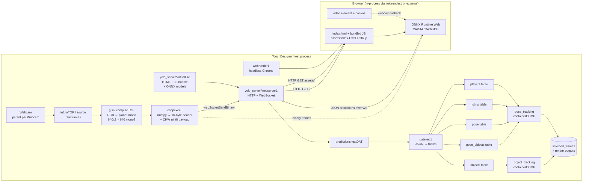

# `/project1/yolo` Architecture Reference

> Comprehensive, node-by-node reference for the `yolo` containerCOMP currently loaded
> at `/project1/yolo` inside the running TouchDesigner project. This document was
> generated by inspecting the live project through the TouchDesigner MCP server and
> reading every text-bearing DAT verbatim.

---

## 1. Project Identity & License

| Field | Value |
| --- | --- |
| Operator path | `/project1/yolo` |
| Operator family | `containerCOMP` |
| Source file | `/Users/patrickhartono/Documents/TD-Experiment/TD-Tools/Yolo/yolo_1_0.tox` (1.1 GB) |
| Upstream project | **`yolo-touchdesigner`** by Torin Blankensmith / **Blankensmithing LLC** |
| Upstream repo | https://github.com/torinmb/yolo-touchdesigner |
| License | **GNU Affero General Public License v3.0 or later (AGPL-3.0+)** |
| Component version | `0.1.0` (from custom param `About → Version`) |
| `.tox Save Build` | `2023.12370` (TouchDesigner 2023.12370) |
| Embedded VFS build date | `2025-09-13` (from `vfsInfo`) |
| Embedded VFS source path | `/Users/torin/Documents/2025/YouTube/yolo-touchdesigner/dist/` (build artefact from upstream author's machine) |

Every Python and HTML source carries a copyright header to that effect:

```
#Copyright (c) 2025 Blankensmithing LLC
#This file is licensed under the GNU Affero General Public License v3.0
#(or later), see https://github.com/torinmb/yolo-touchdesigner/blob/master/LICENSE.txt.
```

This document **only describes** the component. It contains verbatim excerpts of the
upstream source for documentation purposes; the upstream license applies unchanged.
If you redistribute or modify this `.tox`, AGPL-3.0+ obligations propagate to the
network artefacts that interact with the served JavaScript bundle.

---

## 2. TL;DR Architecture

**This component does not run YOLO inside TouchDesigner.** It runs YOLO inside a
**web browser** through ONNX Runtime Web (WebAssembly / WebGPU), and uses
TouchDesigner only as a host process that:

1. Spawns an HTTP + WebSocket server on a free local port (`yolo_server/webserver1`,
   `webserverDAT`).
2. Serves the HTML page, the bundled JavaScript app, the ONNX Runtime WASM/MJS
   bundles, **and the ONNX model weights themselves** out of TouchDesigner's
   in-memory **virtual file system** (`yolo_server/virtualFile/*`) — which is why
   `yolo_1_0.tox` is 1.1 GB on disk.
3. Renders that page in two places:
   - **Internally** via `webrender1` (a `webrenderTOP`) — the network's hidden
     headless browser. This is the path that actually drives the pipeline.
   - **Externally**, optionally, from a real desktop browser pointed at
     `http://localhost:<wsPort>/`.
4. **Pushes** raw webcam frames into the browser as binary WebSocket messages
   (`chopexec3`, packing CHW uint8 tensors with a 16-byte header).
5. **Receives** JSON prediction frames back over the same WebSocket
   (`webserver1_callbacks → predictions DAT`).
6. Parses the JSON into five table DATs (`objects`, `pose_objects`, `pose`,
   `joints`, `players`) via the `datexec1` callback.
7. Visualises the result through two sibling containers: `object_tracking`
   (bounding boxes) and `pose_tracking` (skeleton lines + keypoints).



Two messages cross the WebSocket boundary:

| Direction | Payload | Producer | Consumer |
| --- | --- | --- | --- |
| TD → Browser | Binary CHW uint8 tensor with 16-byte header (frame data) | `chopexec3` calling `webSocketSendBinary` | the JS bundle's ONNX session |
| Browser → TD | UTF-8 JSON text frames of types `yolo_combined`, `webcamDevices`, `tick`, `loaded`, `lastFrameTime` | the JS bundle | `webserver1_callbacks.onWebSocketReceiveText`, which dispatches into runtime DATs |

The `webrender1` URL contains every custom parameter as a query string, so the
JS app boots already configured for the right model, confidence, NMS thresholds,
tracker TTL, and which of the two trackers (object / pose) to enable.

---

## 3. Custom Parameters

The container exposes 4 pages of custom parameters on `parent()`. All non-derived
state lives here.

### 3.1 Settings page

| Par name | Style | Default | Menu choices | Label |
| --- | --- | --- | --- | --- |
| `Webcam` | Menu | `'MacBook Pro Camera (0000:0001)'` | populated at runtime from `webcam_list` JSON (`MacBook Pro Camera`, `Gargantua Camera`, …) | Webcam |
| `Webcamresolutionw` | WH | `1280.0` |  | Webcam Resolution (width) |
| `Webcamresolutionh` | WH | `720.0` |  | Webcam Resolution (height) |
| `Aspectcorrectionw` | WH | `1280.0` |  | Aspect Correction (width) |
| `Aspectcorrectionh` | WH | `720.0` |  | Aspect Correction (height) |
| `Aspectcorrectionenabled` | Toggle | `True` |  | Aspect Correction Enabled |
| `Fliphorizontal` | Toggle | `True` |  | Flip Horizontal |
| `Objecttracking` | Header | `''` |  | Object Tracking |
| `Obecttrackingmodel` | Menu | `'yolo11n'` | `facen`, `yolo11n`, `yolo11s`, `yolo11m`, `yolo11l`, `yolo11x`, `yolo11n-v`, `yolo11s-v`, `yolo11m-v`, `yolo11l-v`, `yolo11x-v` | Model |
| `Generateobjecttrackingui` | Pulse | `False` |  | Generate GUI |
| `Objecttrackingenabled` | Toggle | `True` |  | Enabled |
| `Posetracking` | Header | `''` |  | Pose Tracking |
| `Posemodel` | Menu | `'yolo11n-pose'` | `yolo11n-pose`, `yolo11s-pose`, `yolo11m-pose`, `yolo11l-pose`, `yolo11x-pose` | Model |
| `Generateposetrackingui` | Pulse | `False` |  | Generate GUI |
| `Posetrackingenabled` | Toggle | `True` |  | Enabled |
| `Port` | Int | `64132` (auto-assigned) |  | Websocket Port |
| `Findnewport` | Pulse | `False` |  | Find New Port |
| `Reset` | Pulse | `False` |  | Reset |

Notes:
- `Obecttrackingmodel` is misspelt in the upstream source ("Obect…"); preserved verbatim.
- The model menu name (without extension) is also the VFS key — `yolo11s` resolves
  to `vfs:/project1/yolo/yolo_server/virtualFile:yolo11s.onnx` (see §4.5).
- `Generateobjecttrackingui` / `Generateposetrackingui` clone the respective
  visualisation sub-container into the grandparent so the user can wire instancing
  CHOPs into their own network (see §6.1, `parexec1`).
- `Port` is a *display* of the actual port chosen by `init_port` (§4.2). Set via
  `webserver1.par.port` programmatically, not by the user.
- `Reset` is bound to `webrender1.par.autorestartpulse` (see §6.7) — pulsing it
  reloads the headless browser.

### 3.2 Object Tracking page

| Par name | Style | Default | Label |
| --- | --- | --- | --- |
| `Objectlabels` | DAT | `/project1/yolo/yolo_labels` | Labels |
| `Detscoret` | Float | `0.393` | Detection Confidence |
| `Detiout` | Float | `0.132` | Box Overlap Filter (NMS IoU) |
| `Dettopk` | Int | `400` | Max Objects Per Frame |
| `Postprocessingnsm` | Header | `''` | Post Processing NSM |
| `Detrkttl` | Int | `8` | Track Persistence (frames) |
| `Detrkiou` | Float | `0.0` | Tracking Match Strictness |

### 3.3 Pose Tracking page

| Par name | Style | Default | Label |
| --- | --- | --- | --- |
| `Poselabels` | DAT | `/project1/yolo/pose_labels` | Labels |
| `Posescoret` | Float | `0.318` | Detection Confidence |
| `Poseiout` | Float | `0.45` | Box Overlap Filter (NMS IoU) |
| `Posetopk` | Int | `71` | Max Objects Per Frame |
| `Postprocessingnsm2` | Header | `''` | Post Processing NSM |
| `Posetrkttl` | Int | `1` | Track Persistence (frames) |
| `Posetrkiou` | Float | `0.5` | Tracking Match Strictness |

### 3.4 About page

| Par name | Style | Value | Label |
| --- | --- | --- | --- |
| `Help` | Pulse | `False` | Help & View Source Code |
| `Version` | Str | `'0.1.0'` | Version |
| `Toxsavebuild` | Str | `'2023.12370'` | .tox Save Build |

### 3.5 How the parameters reach the browser

The browser is configured purely through the URL query string that
`webrender1.par.url` constructs (§6.7). Every value above except `Webcam` (which
travels as `webcamLabel`) is passed by URL parameter. The hand-built table DAT
`text2` (§6.6) holds the same URL formula in plain text for debugging.

---

## 4. Subsystem: `yolo_server` (the WebSocket bridge)

Path: `/project1/yolo/yolo_server` — a `baseCOMP` containing the actual TD-side
networking stack.

### 4.1 `webserver1` — the HTTP + WebSocket server

`/project1/yolo/yolo_server/webserver1` is a `webserverDAT`. Non-default
parameters:

```
callbacks   = /project1/yolo/yolo_server/webserver_callbacks  (nullDAT alias of webserver_callback)
minprotocol = 'tls10'
extension   = 'languageext'
wordwrap    = 'input'
```

The actual port is set dynamically by `init_port` (§4.2). The server hosts both
plain HTTP (for the bundle and ONNX assets — §4.5) and WebSocket (for binary
frames in and JSON predictions out). All routing logic lives in the callbacks DAT
(§4.4).

### 4.2 `init_port` — pick a free TCP port at startup

`/project1/yolo/yolo_server/init_port` is an `executeDAT`. Full source:

```python
# me - this DAT
# 
# frame - the current frame
# state - True if the timeline is paused
# 
# Make sure the corresponding toggle is enabled in the Execute DAT.

def get_free_port():
    import socket
    sock = socket.socket()
    sock.bind(('', 0))
    free_port = sock.getsockname()[1]
    sock.close()
    return free_port
   
def setFreePort():
    webServerDAT = op('webserver1')

    thisPort = get_free_port()
    webServerDAT.par.port = thisPort
    webServerDAT.par.restart.pulse()
    return	

def onStart():
    run('setFreePort()', delayFrames=10)
    return

def onCreate():
    run('setFreePort()', delayFrames=10)
    return
```

Annotated behaviour:

- `get_free_port()` opens a TCP socket bound to `('', 0)`. The OS chooses an
  ephemeral free port; the socket is then closed immediately. There is a
  microscopic TOCTOU window between `close()` and the moment `webserverDAT` reopens
  the port — in practice this is fine on a single-host setup.
- `setFreePort()` writes that port into `webserver1.par.port` and pulses
  `webserver1.par.restart`. Restart re-binds the listening socket.
- `onStart` / `onCreate` schedule `setFreePort()` for **10 frames after** load via
  `run(..., delayFrames=10)`. The delay lets `webserver1` finish initialising
  before the first restart pulse hits it.
- All other lifecycle hooks (`onExit`, `onFrameStart`, `onPlayStateChange`, etc.)
  are no-ops.

The user-facing pulse `parent().par.Findnewport` re-invokes the same logic in
upstream code (you can wire it manually if you replace this DAT — by default
this DAT only fires on `onStart` / `onCreate`).

### 4.3 `execute1` + `timer1` — WebSocket keepalive

#### `execute1` (`executeDAT`)

```python
def start():
    op('timer1').par.initialize.pulse()
    op('timer1').par.start.pulse()

def onStart():
    start()
    return

def onCreate():
    start()
    return
```

Re-initialises and starts the timer at project load / component create.

#### `timer1` (`timerCHOP`)

Non-default parameters:

```
active        = 'running'
timecontrol   = 'sequential'
deferpars     = True
lengthtype    = 'fixed'
length        = 5.0    (seconds)
cycle         = True
maxcycles     = 4
ondone        = 'donothing'
outfraction   = True
outrunning    = True
outdone       = True
callbacks     = /project1/yolo/yolo_server/timer1_callbacks
```

A 5-second cyclic timer, cycling up to 4 times (20 seconds of post-start activity)
then idling.

#### `timer1_callbacks` (`textDAT`)

```python
send_pings = mod('webserver_callbacks').send_pings
def onCycleStart(timerOp, segment, cycle):
    send_pings(op('webserver1'))
    return
```

(All other timer hooks are no-ops.)

The module-level `send_pings = mod('webserver_callbacks').send_pings` binds the
ping helper at DAT-evaluation time. Once per cycle (every 5 s), the helper is
invoked with the `webserverDAT` so it can ping every connected WS client; this
keeps idle browsers from getting NAT/proxy timeouts.

### 4.4 `webserver_callback` — full HTTP + WebSocket dispatcher

Path: `/project1/yolo/yolo_server/webserver_callback` (an `inDAT`). An exact copy
sits at `/project1/yolo/webserver1_callbacks` (`textDAT`) at the top level — both
are the same source. Full annotated dump:

```python
#Copyright (c) 2025 Blankensmithing LLC
#This file is licensed under the GNU Affero General Public License v3.0
#(or later), see https://github.com/torinmb/yolo-touchdesigner/blob/master/LICENSE.txt.

import mimetypes
import os
import datetime
import struct
clients = {}                                            # <-- module-level WS client registry

def onHTTPRequest(webServerDAT, request, response):
    uri = request['uri']

    # If root path requested, return the index file
    if uri == "/":
        response['statusCode']    = 200
        response['statusReason']  = 'OK'
        response['data']          = op('index').text    # index_html stored as an inDAT under yolo_server/
        response['Cache-Control'] = 'no-store, no-cache, must-revalidate, max-age=0'
        response['Pragma']        = 'no-cache'
        response['Expires']       = '0'
        return response

    # Extract only the filename (no folder structure in VFS)
    vfsFilename = os.path.basename(uri)                 # e.g. /assets/index-CwhO-rHR.js -> index-CwhO-rHR.js

    # Try to get the file from VFS
    vfsFile = op('virtualFile').vfs[vfsFilename]

    if vfsFile:
        fileContent = vfsFile.byteArray
        fileName    = vfsFile.name

        special_filenames = [
            "ort-wasm-simd-threaded.jsep.mjs",
            "ort-wasm-simd-threaded.jsep.wasm"
        ]
        for fname in special_filenames:
            if uri.endswith(fname):
                fileContent = vfsFile.byteArray
                mimeType    = mimetypes.guess_type(fname, strict=False)[0]
                # Some CDNs expect the correct MIME types
                if fname.endswith(".wasm"):
                    mimeType = "application/wasm"
                if fname.endswith(".mjs"):
                    mimeType = "application/javascript"
                if not mimeType:
                    mimeType = "application/octet-stream"
                response['Content-Type']  = mimeType
                response['statusCode']    = 200
                response['statusReason']  = 'OK'
                response['data']          = fileContent
                response['Cache-Control'] = 'no-store, no-cache, must-revalidate, max-age=0'
                response['Pragma']        = 'no-cache'
                response['Expires']       = '0'
                return response

        # Guess mime type for any other VFS file
        mimeType = mimetypes.guess_type(fileName, strict=False)[0]
        if fileName.endswith('.bin'):
            mimeType = 'application/octet-stream'
        if not mimeType:
            mimeType = 'application/octet-stream'

        response['Content-Type']  = mimeType
        response['statusCode']    = 200
        response['statusReason']  = 'OK'
        response['data']          = fileContent
        response['Cache-Control'] = 'no-store, no-cache, must-revalidate, max-age=0'
        response['Pragma']        = 'no-cache'
        response['Expires']       = '0'
        return response

    # File not found
    response['statusCode']   = 404
    response['statusReason'] = 'Not Found'
    response['data']         = b'File not found'
    return response

def onWebSocketOpen(webServerDAT, client, uri):
    clients[client] = True
    op('webserver1').addWarning(f"[{datetime.datetime.now().isoformat()}] Client connected: {client}")
    print(f"[{datetime.datetime.now().isoformat()}] Client connected: {client}")
    op('active_client').text = client                    # store the address of the most recent client
    return

def onWebSocketClose(webServerDAT, client):
    if client in clients:
        del clients[client]
        op('webserver1').addWarning(f"[{datetime.datetime.now().isoformat()}] Client disconnected: {client}")
        print(f"[{datetime.datetime.now().isoformat()}] Client disconnected: {client}")
        op('active_client').text = ''
    return

def onWebSocketReceiveText(webServerDAT, client, data):
    # If we receive results data, dump it directly into the relevant DAT
    # Doing this here as TD 2022.33910 is much faster processing this at the WS server than WS client
    if('type' in data):
        op('predictions').text = data                    # combined predictions go straight into predictions DAT
    elif('webcamDevices' in data):
        op('webcam_list').text = data                    # update menu choices source
    elif('tick' in data):
        op('tick').text = data                           # heartbeat
    # elif('loading' in data):
    # 	parent().par.State = "Loading"
    elif('loaded' in data):
        parent().par.Loading = 0                         # browser signalled model loaded -> drop the loading state on container
    elif('lastFrameTime' in data):
        op('status').text = data                         # NOTE: 'status' DAT is referenced but not actually created by upstream

    else:
        # print('received WS from client: ' +client)
        for key in clients.keys():
            if key != client:
                # print('forwaring WS message to client: ' +key)
                webServerDAT.webSocketSendText(key, data)
    return

def onWebSocketReceiveBinary(webServerDAT, client, data):
    return

def onWebSocketReceivePing(webServerDAT, client, data):
    webServerDAT.webSocketSendPong(client, data=data)
    return

def onWebSocketReceivePong(webServerDAT, client, data):
    return

def onServerStart(webServerDAT):
    return

def onServerStop(webServerDAT):
    return

def send_pings(webServerDAT):
    global clients
    for client in list(clients.keys()):
        try:
            webServerDAT.webSocketSendPing(client)
        except Exception as e:
            # Optionally log or clean up dead clients
            pass
```

Per-handler annotation:

- `onHTTPRequest`:
  - **`/`** returns the static `index_html` (served from `op('index')`, which is a
    nullDAT wired to `yolo_server/index_html`).
  - Anything else is treated as a VFS lookup keyed by *basename only*. So URLs
    like `/assets/index-CwhO-rHR.js` resolve to the VFS entry
    `index-CwhO-rHR.js`. This means the folder layout in the original `dist/` build
    output is flattened on serve.
  - Two filenames get hard-coded MIME types: `ort-wasm-simd-threaded.jsep.mjs`
    (→ `application/javascript`) and `ort-wasm-simd-threaded.jsep.wasm`
    (→ `application/wasm`). Browsers refuse to instantiate WebAssembly that comes
    back with the wrong MIME, hence the special case.
  - Every response disables HTTP caching aggressively. This trades bandwidth for
    correctness — the browser always re-fetches when the user reloads.
- `onWebSocketOpen` / `onWebSocketClose` maintain the `clients` registry and
  mirror the most recent client into `active_client` (so `chopexec3` knows where
  to send binary frames).
- `onWebSocketReceiveText` is the heart of the inbound protocol. It looks for
  *substrings* in the raw payload (`'type' in data`, `'tick' in data`, etc.) — a
  fast pre-parse before any JSON decoding. The comment notes that handling the
  data at the WS-server side is much faster than letting a downstream
  WebSocketDAT-style client parse it, in TouchDesigner 2022.33910+.
- The `# elif('loading' in data):` branch is commented out; loading state is
  derived from `info1.loaded` (see §6.6).
- The reference to `op('status').text` is a known dangling lookup — there is no
  `status` DAT in this build. `lastFrameTime` messages are therefore swallowed.
- Anything *else* is broadcast to every other connected client. This relay path
  is what allows you to open the page in a second external browser tab and have
  it stay in sync with the headless one.
- `send_pings` iterates a snapshot of `clients` (`list(clients.keys())`) — the
  snapshot is necessary because the dict may mutate if a peer disconnects mid-iter.

### 4.5 `virtualFile` — the embedded asset bundle

Path: `/project1/yolo/yolo_server/virtualFile` (a `baseCOMP`). It is a thin custom
wrapper around TouchDesigner's standard palette `virtualFile` component (the
familiar palette extension `TDFunctions`/`TDJSON` helper). It exposes high-level
methods like `AddFile`, `AddFromTable`, `AddFromImage`, `Find`, `RemoveFiles`,
`Rename` on its extension class `VirtualFileExt`. The full extension class is
included below for reference, but the key fact is: **the operative content of
this baseCOMP is not the wrapper code, it is the bundled VFS payload**.

#### What is embedded (from `vfsInfo`)

`yolo_server/virtualFile/vfsInfo` (a `scriptDAT`) inventories the bundle. The
build artefact reflects torinmb's `dist/` directory at `2025-09-13 00:20:08–09`.

| Filename | Size | Original disk path |
| --- | --- | --- |
| `favicon.ico` | 1 150 B | `dist/favicon.ico` |
| `index.html` | 797 B | `dist/index.html` |
| `index-CwhO-rHR.js` | 413 338 B | `dist/assets/index-CwhO-rHR.js` (the entry bundle) |
| `ort-wasm-simd-threaded.jsep.mjs` | 44 677 B | `dist/ort-wasm-simd-threaded.jsep.mjs` |
| `ort-wasm-simd-threaded.jsep.wasm` | 21 872 216 B | `dist/ort-wasm-simd-threaded.jsep.wasm` |
| `ort-wasm-simd-threaded.jsep-CLPRrI3A.wasm` | 21 872 216 B | `dist/assets/ort-wasm-simd-threaded.jsep-CLPRrI3A.wasm` |
| `ort-wasm-simd-threaded.mjs` | 20 856 B | `dist/ort-wasm-simd-threaded.mjs` |
| `ort-wasm-simd-threaded.wasm` | 11 210 254 B | `dist/ort-wasm-simd-threaded.wasm` |
| `ort.all.bundle.min.mjs` | 835 333 B | `dist/ort.all.bundle.min.mjs` |
| `ort.all.min.mjs` | 791 835 B | `dist/ort.all.min.mjs` |
| `ort.all.mjs` | 5 674 750 B | `dist/ort.all.mjs` |
| `ort.bundle.min.mjs` | 400 877 B |  |
| `ort.min.mjs` | 357 568 B |  |
| `ort.mjs` | 2 547 321 B |  |
| `ort.node.min.mjs` | 25 489 B |  |
| `ort.wasm.bundle.min.mjs` | 48 273 B |  |
| `ort.wasm.min.mjs` | 48 259 B |  |
| `ort.wasm.mjs` | 550 214 B |  |
| `ort.webgl.min.mjs` | 453 962 B |  |
| `ort.webgl.mjs` | 3 362 462 B |  |
| `ort.webgpu.bundle.min.mjs` | 400 898 B |  |
| `ort.webgpu.min.mjs` | 357 582 B |  |
| `ort.webgpu.mjs` | 2 547 332 B |  |
| `yolo-decoder.onnx` | 1 921 B | tiny ONNX decoder graph for post-processing |
| `yolo11n.onnx` | 10 693 624 B | YOLO11 nano detector |
| `yolo11s.onnx` | 38 003 712 B |  |
| `yolo11m.onnx` | 80 616 665 B |  |
| `yolo11l.onnx` | 101 693 919 B |  |
| `yolo11x.onnx` | 227 979 952 B |  |
| `yolo11n-v.onnx` | 10 538 741 B | VisDrone-trained variants (see `visdrone_labels`) |
| `yolo11s-v.onnx` | 37 903 263 B |  |
| `yolo11m-v.onnx` | 80 376 270 B |  |
| `yolo11l-v.onnx` | 101 606 540 B |  |
| `yolo11x-v.onnx` | 227 655 554 B |  |
| `yolo11n-pose.onnx` | 11 675 630 B | YOLO11 pose models |
| `yolo11s-pose.onnx` | 39 886 037 B |  |
| `yolo11m-pose.onnx` | 83 855 892 B |  |
| `yolo11l-pose.onnx` | 104 984 708 B |  |
| `yolo11x-pose.onnx` | 235 407 510 B |  |
| `facen.onnx` | 10 517 703 B | face-detection variant (from `ONNX_Models/facen.onnx`) |

That table is **why** `yolo_1_0.tox` weighs 1.1 GB — every ONNX model variant the
component can switch between is embedded in the VFS so the browser can fetch them
over the loopback HTTP server.

#### `VirtualFileExt` (the wrapper class)

Full source preserved verbatim (it's the upstream palette extension; not all
methods are exercised in this network — `AddFile`, `AddFromTable`, `AddFromImage`,
`Find`, `RemoveFiles`, `RemoveSingle`, `Rename` are exposed through the
component's custom params). Key points only:

- `__init__` clears the component's script errors on load.
- `onParPulse` is the dispatch table for the custom-page pulses (`Add`, `List`,
  `Remove`, `Addfromtable`, `Removesingle`, `Addfromtop`, `Rename`).
- `AddFile` resolves a disk path to a VFS entry via the underlying TD call
  `op(...).vfs.addFile(filePath, overrideName=...)`. Every operation is performed
  via `runCommand(...)` which optionally echoes the command back to the textport
  (toggle via `Echocommands`).
- `AddFromTable` consumes a tab-separated table that has at least a `path` column,
  optionally also `overrideName`, and recurses through `AddFile`.
- `AddFromImage` invokes `top.saveByteArray('<filetype>')` on the configured
  `Imagesourcetop`, then `vfs.addByteArray(...)` to embed it under an
  auto-incremented name.
- `Rename` rewrites the `name` attribute on an existing VFS entry.
- `openRenameDialog` / `onRenameDialog` use `op.TDResources.op('popDialog').OpenDefault`
  for an in-app rename UX.

The full text (8 645 chars) is identical to the standard TD palette extension —
treat upstream's palette docs as authoritative. We don't reproduce the body in
full here.

#### Other VFS-baseCOMP children

- `inPaths` (`inDAT`) — the input table that `AddFromTable` consumes. Empty at runtime (header only: `name\tpath`).
- `vfsInfo` (`scriptDAT`) — read-only inventory rendered above. Its `script1_callbacks` is generic:

  ```python
  def onSetupParameters(scriptOp):
      page = scriptOp.appendCustomPage('Custom')
      page.appendPython('Dictlist', label='Dict List')
      page.appendStr('Keyorder', label='Key Order')

  def onCook(scriptOp):
      scriptOp.clear()
      keys = scriptOp.par.Keyorder.eval().split()
      scriptOp.appendRow(keys)
      for virtualFile in scriptOp.par.Dictlist.eval():
          scriptOp.appendRow([getattr(virtualFile, k) for k in keys])
  ```

  The `Dictlist` custom param is evaluated to the live list of VFS file objects
  on every cook, and `Keyorder` chooses which attributes (`name`, `virtualPath`,
  `originalFilePath`, `date`, `size`) become columns.
- `parexec1`:

  ```python
  def onValueChange(par, prev):
      ext.VirtualFileExt.onParValueChange(par, prev)

  def onPulse(par):
      ext.VirtualFileExt.onParPulse(par)
  ```

  Forwards pulses/changes to the extension.
- `inPathsPar` (`selectDAT`), `docsHelper/*` — palette boilerplate.

#### `vfs_folder` (top of `yolo_server`)

`/project1/yolo/yolo_server/vfs_folder` is an `inDAT` holding a header-only table
(`name\tpath`). It is the configuration input wired into `virtualFile/inPaths`
when adding new files. Empty by default — the bundle is pre-baked.

### 4.6 Runtime DATs

These DATs are written by `onWebSocketReceiveText` (§4.4) and consumed downstream.

- **`predictions`** (`textDAT`) — the per-frame `yolo_combined` JSON. See §12 for
  a full schema. Example (one person, one detection):
  ```json
  {
    "type": "yolo_combined",
    "frame": 4294967295,
    "seq": 0,
    "videoFrame": 381.70832,
    "width": 640,
    "height": 640,
    "yolo": [
      {"tx": 0.386, "ty": 0.324, "width": 0.199, "height": 0.244,
       "categoryName": [0], "score": 0.407, "id": 127}
    ],
    "yolo_pose": [
      {"tx": 0.392, "ty": 0.316, "width": 0.200, "height": 0.247,
       "categoryName": [0], "score": 0.629, "id": 365,
       "keypoints": [
         {"x": 0.477, "y": 0.451, "score": 0.960},
         ... (17 keypoints) ...
       ]}
    ]
  }
  ```
- **`tick`** (`textDAT`) — JSON keepalive heartbeat from browser. Example:
  `{"tick":875.9956}`. Drives `json2` (§6.6) and downstream frame-drift maths.
- **`active_client`** (`textDAT`) — last connected WS client address. Example:
  `127.0.0.1:64147`. Consumed by `chopexec3` to pick a destination for binary
  frames.
- **`webcam_list`** (`tableDAT`) — JSON list of webcam devices the browser
  enumerated via `navigator.mediaDevices`. Example:
  `{"webcamDevices":["MacBook Pro Camera (0000:0001)","Gargantua Camera"]}`. This
  is what populates the `Webcam` menu's choices.

---

## 5. Subsystem: Browser Client

This subsystem doesn't live inside TouchDesigner; it's a Vite/Rollup-built single
page app bundled into the VFS. From the network's perspective the only visible
artefacts are the HTML scaffold and the protocol contract.

### 5.1 `index.html`

`/project1/yolo/yolo_server/index_html` (an `inDAT`). Full content:

```html
<!--Copyright (c) 2025 Blankensmithing LLC
This file is licensed under the GNU Affero General Public License v3.0
(or later), see https://github.com/torinmb/yolo-touchdesigner/blob/master/LICENSE.txt. -->

<!DOCTYPE html>
<html lang="en">
    <head>
        <meta charset="UTF-8" />
        <meta name="viewport" content="width=device-width, initial-scale=1.0" />
        <title>Yolo Plugin for TouchDesigner</title>
      <script type="module" crossorigin src="./assets/index-CwhO-rHR.js"></script>
    </head>
    <body>
        <div id="container">
            <video id="video" autoplay muted playsinline></video>
            <canvas id="overlay"></canvas>
            <canvas id="hidden-canvas"></canvas>
            <div id="status">Loading model...</div>
        </div>
    </body>
</html>
```

- `<video>` is the webcam feed surface (used when the browser uses its own
  webcam — see binary-frame fallback below).
- `<canvas id="hidden-canvas">` is the off-screen draw target used to convert
  the video frame into an `ImageData` / tensor.
- `<canvas id="overlay">` is the on-screen overlay where the JS app draws
  detections (only visible when the page is loaded in an external browser).
- `<div id="status">` shows "Loading model..." until the JS app reports back.

The accompanying JS bundle `assets/index-CwhO-rHR.js` (413 KB) is intentionally
opaque to this document. To regenerate or audit it, build the upstream repo:
`git clone https://github.com/torinmb/yolo-touchdesigner && npm install && npm run build`
then re-upload `dist/` into the VFS via `VirtualFileExt.AddFromTable`.

### 5.2 The WebSocket protocol

Browser → TouchDesigner (all JSON over text frames). Keys in order of dispatch
priority used by `webserver_callback`:

| Trigger substring | JSON shape | TD effect |
| --- | --- | --- |
| `type` | full prediction frame, e.g. `{"type":"yolo_combined", ...}` | overwrite `predictions` DAT |
| `webcamDevices` | `{"webcamDevices":[...]}` | overwrite `webcam_list` DAT (also drives the `Webcam` menu) |
| `tick` | `{"tick":<float seconds>}` | overwrite `tick` DAT (heartbeat) |
| `loaded` | `{"loaded":true}` or similar | clear `parent().par.Loading` (drops loading overlay) |
| `lastFrameTime` | `{"lastFrameTime":<float>}` | (dead-ended — references missing `status` DAT) |
| anything else | arbitrary | relayed to every other connected client |

TouchDesigner → Browser:

- **Binary** frames (`chopexec3 → webserver1.webSocketSendBinary`) — see §6.3. A
  16-byte little-endian header (`TYPE_TENSOR=10, DTYPE_U8=1, LAYOUT_CHW=1,
  reserved, H:uint16, W:uint16, seq:uint32, frame:uint32`) followed by `3*H*W`
  bytes of CHW planar uint8 pixels.
- **Pings** (`webserver1.webSocketSendPing`) — see `send_pings` and §4.3.

### 5.3 URL parameters consumed by the browser app

Built by `webrender1.par.url` (and mirrored in `text2` for reference). All
URL-escaped via the inline list `' %<>#{}|\\^~[]\``:

```
http://localhost:<wsPort>/?
  wsPort=<int>
  &webcamLabel=<str>
  &binary=<0|1>             # parent.inputs > 0  -> TD will push binary frames
  &flipHorizontal=<bool>
  &Posetrackingenabled=<0|1>
  &Objecttrackingenabled=<0|1>
  &Posemodel=<str>
  &Obecttrackingmodel=<str>
  &Posescoret=<float>
  &Detscoret=<float>
  &Poseiout=<float>
  &Detiout=<float>
  &Posetopk=<int>
  &Dettopk=<int>
  &Posetrkiou=<float>
  &Detrkiou=<float>
  &Posetrkttl=<int>
  &Detrkttl=<int>
```

`text2` carries an additional "dev" line targeting `http://localhost:5173/?...`
which corresponds to the Vite dev server during upstream development; ignored at
runtime, it's a debugging convenience left in the source.

---

## 6. Subsystem: Top-level glue logic

Operators directly under `/project1/yolo` that wire everything together. Many
top-level DATs are mirrors or `null`s of operators inside `yolo_server` — pulled
up to the parent scope so external callers (and `parexec1`'s pulse handlers) can
reach them through `parent()` without a path prefix.

### 6.1 `parexec1` — "Generate GUI" pulses

`/project1/yolo/parexec1` (a `parameterexecuteDAT`). Full source:

```python
def connect_with_mapping(src_op, dest_op, mapping):
    for out_idx, in_idx in mapping.items():
        outc = src_op.outputConnectors[out_idx]
        inc  = dest_op.inputConnectors[in_idx]
        if not any(c.owner == dest_op and c.index == in_idx for c in outc.connections):
            outc.connect(inc)

def copy_op_with_offset(src_path, dest_parent, ref_op, new_name=None, offset=(200, 0)):
    src = op(src_path)
    if not src:
        raise ValueError(f"Source OP '{src_path}' not found")

    new_name = new_name or (src.name + "_copy")
    new = dest_parent.op(new_name)
    if not new:
        new = dest_parent.copy(src, name=new_name)
        new.nodeX = ref_op.nodeX + offset[0]
        new.nodeY = ref_op.nodeY + offset[1]
    return new

# ---- usage
destParent = parent(2)
refOp      = parent()

def onPulse(par):
    if par.name == 'Generateobjecttrackingui':
        obj_new = copy_op_with_offset('object_tracking', destParent, refOp,
                                       'object_tracking', (200, 0))
        connect_with_mapping(refOp, obj_new, {0: 0, 4: 1})
        obj_new.allowCooking = True
    elif par.name == 'Generateposetrackingui':
        pose_new = copy_op_with_offset('pose_tracking', destParent, refOp,
                                       'pose_tracking', (200, -150))
        connect_with_mapping(refOp, pose_new, {1: 0, 2: 1, 3: 2, 4: 3})
        pose_new.allowCooking = True
    return
```

Annotated behaviour:

- `destParent = parent(2)` resolves to the *grandparent* of this DAT
  (i.e. `/project1` if the container sits at `/project1/yolo`).
- `refOp = parent()` is the `yolo` container itself.
- When the user pulses **`Generate GUI`** under either tracker page, the matching
  internal `object_tracking` / `pose_tracking` container is copied to the
  grandparent (so it lives **next to** `yolo`, not inside it).
- The new copy is then wired to consume specific output connectors of the `yolo`
  container. The container exposes six output connectors mapped to internal
  `outX` operators (verified via `op('/project1/yolo').outputConnectors`):

  | `yolo.outX` | Internal source | Carries |
  | --- | --- | --- |
  | `out0` | `objects1` outDAT | Detection bboxes table |
  | `out1` | `pose_objects1` outDAT | Pose bboxes table |
  | `out2` | `pose1` outDAT | Flat pose keypoints table |
  | `out3` | `joints1` outDAT | Per-person joint matrix table |
  | `out4` | `snyched_frame1` outTOP | Synched source frame texture |
  | `out5` | `info` outCHOP | Info channels |

  - For **objects**: `yolo.out0 → object_tracking.in0` (objects table),
    `yolo.out4 → object_tracking.in1` (synched frame TOP).
  - For **poses**: `yolo.out1 → pose_tracking.in0` (pose_objects table),
    `yolo.out2 → pose_tracking.in1` (flat pose table),
    `yolo.out3 → pose_tracking.in2` (joints matrix table),
    `yolo.out4 → pose_tracking.in3` (synched frame TOP).
- `connect_with_mapping` is idempotent (it skips wires that already exist), so
  re-pulsing won't duplicate connections.
- `allowCooking = True` is asserted on the new instance, because the internal
  template instance is normally kept "cold" (`allowCooking = False`) inside `yolo`
  to keep the .tox from cooking two visualisation pipelines simultaneously.

This is the upstream "drag-out an external visualizer" workflow — generate a
copy outside the .tox, wire it once, then you can edit/customise it without
touching the protected component.

### 6.2 `datexec1` — the JSON-to-tables parser

`/project1/yolo/datexec1` (a `datexecuteDAT`). 11 370 chars. This is the largest
piece of Python in the component; it runs on every change to the input DAT (which
upstream wires to the `predictions` textDAT, see §6.5) and writes five output
tables.

Full source with section-by-section commentary:

#### 6.2.1 Top-of-file static config

```python
# TouchDesigner Python — per-frame table writer with separate pose/object label lookups
import json
import tdu

# ---------- Static config / caches (evaluated once) ----------
JOINT_NAMES = [
    'nose',
    'left_eye', 'right_eye',
    'left_ear', 'right_ear',
    'left_shoulder', 'right_shoulder',
    'left_elbow', 'right_elbow',
    'left_wrist', 'right_wrist',
    'left_hip', 'right_hip',
    'left_knee', 'right_knee',
    'left_ankle', 'right_ankle',
]

# Objects/pose headers
OBJECTS_HEADER = ('id', 'object', 'object_id', 'x', 'y', 'width', 'height', 'score')
POSE_HEADER    = ('x', 'y', 'score')

# Joints header (static: 17 keypoints × [x,y,score])
JOINTS_HEADER = tuple(
    f'{name}:{field}'
    for name in JOINT_NAMES
    for field in ('x', 'y', 'score')
)

# Cache operator references once
_objects       = op('objects')
_pose_objects  = op('pose_objects')   # pose bboxes/objects go here
_pose          = op('pose')
_joints        = op('joints')
_players       = op('players')        # wide table, columns per person, rows per joint
_PARENT        = parent()             # cache parent() once
```

- Joint order matches COCO 17-keypoint convention (used by Ultralytics pose models).
- All operator handles are resolved once at module-eval time; on hot edits the DAT
  will be re-evaluated and these will refresh.
- `_players` is special — its column count is dynamic (one triple per detected
  person), so it gets its header rebuilt every frame.

```python
_missing = [
    name for name, ref in [
        ('objects', _objects),
        ('pose_objects', _pose_objects),
        ('pose', _pose),
        ('joints', _joints),
        ('players', _players),
    ] if ref is None
]
if _missing:
    raise RuntimeError("Missing required Table DATs: " + ", ".join(_missing))

def _ensure_header(tab, header_tuple):
    if tab.numRows == 0 or tab.numCols != len(header_tuple):
        tab.clear()
        tab.appendRow(list(header_tuple))
    else:
        for c, name in enumerate(header_tuple):
            if tab[0, c].val != name:
                tab[0, c] = name

# Ensure static headers once
_ensure_header(_objects, OBJECTS_HEADER)
_ensure_header(_pose_objects, OBJECTS_HEADER)
_ensure_header(_pose,    POSE_HEADER)
_ensure_header(_joints,  JOINTS_HEADER)
# _players header is dynamic (depends on # people), so we handle it per-frame
```

- Validates that all five tables exist (DAT-eval-time guard).
- `_ensure_header` is idempotent — only rewrites cells that differ from the
  desired header. Cheap when stable, correct after refactors.

#### 6.2.2 Label DAT resolvers

```python
_obj_labels_path_cached  = None
_obj_labels_dat_cached   = None
_pose_labels_path_cached = None
_pose_labels_dat_cached  = None

def _get_labels_dat(kind='object'):
    """Resolve labels DAT from parent params:
       - kind='object' -> parent().par.Objectlabels
       - kind='pose'   -> parent().par.Poselabels
    """
    global _obj_labels_path_cached, _obj_labels_dat_cached
    global _pose_labels_path_cached, _pose_labels_dat_cached

    if kind == 'object':
        try:
            par = _PARENT.par.Objectlabels
        except Exception:
            return None
        path = par.eval() if hasattr(par, 'eval') else str(par)
        if not path:
            _obj_labels_path_cached, _obj_labels_dat_cached = None, None
            return None
        if path != _obj_labels_path_cached:
            _obj_labels_path_cached = path
            _obj_labels_dat_cached  = op(path)
        return _obj_labels_dat_cached

    else:  # kind == 'pose'
        try:
            par = _PARENT.par.Poselabels
        except Exception:
            return None
        path = par.eval() if hasattr(par, 'eval') else str(par)
        if not path:
            _pose_labels_path_cached, _pose_labels_dat_cached = None, None
            return None
        if path != _pose_labels_path_cached:
            _pose_labels_path_cached = path
            _pose_labels_dat_cached  = op(path)
            return _pose_labels_dat_cached
        return _pose_labels_dat_cached

def _resolve_label(categoryNameValue, kind='object'):
    """Map numeric/categoryName to human-readable label using the correct labels DAT."""
    obj_raw = categoryNameValue
    if isinstance(obj_raw, (list, tuple)) and obj_raw:
        obj_raw = obj_raw[0]

    def _as_int():
        try:
            return int(obj_raw)
        except Exception:
            return None

    idx = _as_int()
    labels_dat = _get_labels_dat(kind)
    if idx is not None and labels_dat is not None:
        cell = tdu.tryExcept(lambda: labels_dat[idx, 0], idx)
        return cell.val if hasattr(cell, 'val') else str(cell)
    return str(obj_raw)
```

- Two label DATs are configured on the parent: `parent().par.Objectlabels` and
  `parent().par.Poselabels`. The values point to tableDATs (`yolo_labels` or
  `visdrone_labels` for objects, `pose_labels` for poses).
- The resolver caches the label DAT handle per kind; only re-fetched when the
  underlying parameter path changes (i.e. the user switches between `yolo_labels`
  and `visdrone_labels`).
- `_resolve_label` accepts either a plain int (`0 → 'person'`) or a list
  containing one (`[0] → 'person'`) — the latter is what `categoryName` looks
  like in the JSON.
- Out-of-range or non-numeric category indices fall back to `str(obj_raw)` so the
  table cell never goes empty.

#### 6.2.3 Aspect-correction helpers

```python
_buf_rows     = []
_buf_vals     = []
_buf_hdr_pl   = []
_buf_rows_pl  = []

def _compute_y_offset_once():
    """Compute (h - w) / (2*w) if enabled and w > h; else 0.0. Safe for bad/missing params."""
    try:
        par = _PARENT.par
        if not par.Aspectcorrectionenabled.eval():
            return 0.0
        h = float(par.Aspectcorrectionh.eval())
        w = float(par.Aspectcorrectionw.eval())
        if w == 0.0:
            return 0.0
        if w > h:
            return (h - w) / (2.0 * w)
        return 0.0
    except Exception:
        return 0.0

def _compute_x_offset_once():
    """Compute (w - h) / (2*h) if enabled and h > w; else 0.0. Safe for bad/missing params."""
    try:
        par = _PARENT.par
        if not par.Aspectcorrectionenabled.eval():
            return 0.0
        h = float(par.Aspectcorrectionh.eval())
        w = float(par.Aspectcorrectionw.eval())
        if h == 0.0:
            return 0.0
        if h > w:
            return (w - h) / (2.0 * h)
        return 0.0
    except Exception:
        return 0.0

def _add_off(val, off):
    """Add offset to numeric-like values; leave strings/empties untouched."""
    if val is None or val == '':
        return val
    if off == 0.0:
        return val
    if isinstance(val, (int, float)):
        return val + off
    try:
        return float(val) + off
    except Exception:
        return val
```

- The browser's predictions arrive in *square* normalised space (`(x,y) ∈ [0,1]`
  with the inference image padded to 1:1 — typically 640 × 640). The actual
  camera output is usually 16:9. When `Aspectcorrectionenabled` is on, this code
  undoes the letterbox/pillarbox by translating Y (or X) so that overlays line up
  with the real-aspect TOP downstream.
- Both offset functions return `0.0` for any error or edge case (missing
  parameter, zero divisor) so a broken aspect setting never poisons downstream
  geometry.
- `_buf_rows`, `_buf_vals`, `_buf_hdr_pl`, `_buf_rows_pl` are module-level lists
  reused across frames to avoid GC churn on hot paths.

#### 6.2.4 Stream extraction and table writers

```python
def _extract_streams(d):
    """
    Returns (preds_det, preds_pose) lists based on payload shape.
    Supports:
      - type: 'yolo_combined' with keys 'yolo', 'yolo_pose'
      - legacy: type 'yolo' or 'yolo_pose' with 'predictions'
      - fallback inference if 'type' missing: presence of keypoints => pose
    """
    preds_det, preds_pose = [], []
    t = d.get('type', '')

    if t == 'yolo_combined':
        preds_det  = d.get('yolo') or []
        preds_pose = d.get('yolo_pose') or []
        return preds_det, preds_pose

    preds = d.get('predictions') or []

    if t == 'yolo':
        preds_det = preds
    elif t == 'yolo_pose':
        preds_pose = preds
    else:
        if preds and any(isinstance(p, dict) and 'keypoints' in p for p in preds):
            preds_pose = preds
        else:
            preds_det = preds

    return preds_det, preds_pose

def _write_objects_like(preds, tab, label_kind='object', x_offset=0.0, y_offset=0.0):
    """Write bbox rows to a given table (objects-style), resolving labels via label_kind."""
    tab.clear(keepFirstRow=True)
    if not preds:
        return
    _buf_rows.clear()
    for p in preds:
        pid       = p.get('id', '')
        object_id = tdu.tryExcept(lambda: p.get('categoryName', '')[0], '')
        obj_label = _resolve_label(object_id, kind=label_kind)
        x         = _add_off(p.get('tx', ''), x_offset)
        y         = _add_off(p.get('ty', ''), y_offset)
        w         = p.get('width', '')
        h         = p.get('height', '')
        score     = p.get('score', '')
        _buf_rows.append([pid, obj_label, object_id, x, y, w, h, score])
    if _buf_rows:
        tab.appendRows(_buf_rows)
```

- Three legacy shapes are supported (`yolo_combined`, `yolo`, `yolo_pose`); a
  fallback for missing `type` infers pose vs detection by looking for
  `keypoints` on a member dict.
- `_write_objects_like` is reused for both `objects` and `pose_objects` —
  `pose_objects` is just bounding boxes around pose people. The only difference
  is the `label_kind` ('object' vs 'pose') so the right labels DAT is consulted.
- `tab.clear(keepFirstRow=True)` is the idiomatic TD trick: it keeps the header.
- Buffering is preserved across frames; `_buf_rows.clear()` empties the existing
  list in place rather than re-allocating.

```python
def _write_pose_tables(preds_pose, x_offset=0.0, y_offset=0.0):
    """Write pose-related tables: pose (flat), joints (per person), players (wide)."""
    _pose.clear(keepFirstRow=True)
    _joints.clear(keepFirstRow=True)
    _players.clear()

    if not preds_pose:
        return

    # ---- pose (flat) ----
    _buf_rows.clear()
    for p in preds_pose:
        kps = p.get('keypoints') or []
        for kp in kps:
            _buf_rows.append([
                _add_off(kp.get('x', ''), x_offset),
                _add_off(kp.get('y', ''), y_offset),
                kp.get('score', '')
            ])
    if _buf_rows:
        _pose.appendRows(_buf_rows)

    # ---- joints (per-person row, 17*3 per row) ----
    _buf_rows.clear()
    for p in preds_pose:
        kps = p.get('keypoints') or []
        _buf_vals.clear()
        for j_idx in range(len(JOINT_NAMES)):
            kp = kps[j_idx] if j_idx < len(kps) else {}
            _buf_vals.extend((
                _add_off(kp.get('x', ''), x_offset),
                _add_off(kp.get('y', ''), y_offset),
                kp.get('score', '')
            ))
        _buf_rows.append(list(_buf_vals))
    if _buf_rows:
        _joints.appendRows(_buf_rows)

    # ---- players (wide; header depends on number of people) ----
    people_count = len(preds_pose)
    _buf_hdr_pl.clear()
    for i in range(1, people_count + 1):
        _buf_hdr_pl.extend((f'p{i}:x', f'p{i}:y', f'p{i}:score'))
    _players.appendRow(_buf_hdr_pl)

    _buf_rows_pl.clear()
    for j_idx in range(len(JOINT_NAMES)):
        row_vals = []
        for p in preds_pose:
            kps = p.get('keypoints') or []
            kp = kps[j_idx] if j_idx < len(kps) else {}
            row_vals.extend((
                _add_off(kp.get('x', ''), x_offset),
                _add_off(kp.get('y', ''), y_offset),
                kp.get('score', '')
            ))
        _buf_rows_pl.append(row_vals)
    if _buf_rows_pl:
        _players.appendRows(_buf_rows_pl)
```

Three different shapes of the *same* keypoint data are written:

- **`pose`** — one row per keypoint, flat across everyone. Use when you treat
  detected joints as point clouds.
- **`joints`** — one row per person, 51 columns (17 keypoints × `x`, `y`, `score`).
  Static header. Use when you want a single record per detected person.
- **`players`** — one *column triple* per person, 17 rows of `(x, y, score)`.
  Dynamic header. Use when you want a wide CHOP-friendly table indexed by joint.

Missing keypoints are padded to an empty dict; downstream `_add_off` then returns
`''`. This guarantees fixed shape per person across frames.

#### 6.2.5 Core update and callback

```python
def _update_from_dict(d):
    preds_det, preds_pose = _extract_streams(d)

    x_offset = _compute_x_offset_once()
    y_offset = _compute_y_offset_once()

    _write_objects_like(preds_det,  _objects,
                        label_kind='object', x_offset=x_offset, y_offset=y_offset)
    _write_objects_like(preds_pose, _pose_objects,
                        label_kind='pose',   x_offset=x_offset, y_offset=y_offset)
    _write_pose_tables(preds_pose,  x_offset=x_offset, y_offset=y_offset)

def onTableChange(dat):
    txt = dat.text
    if not txt:
        _objects.clear(keepFirstRow=True)
        _pose_objects.clear(keepFirstRow=True)
        _pose.clear(keepFirstRow=True)
        _joints.clear(keepFirstRow=True)
        _players.clear()
        return
    try:
        d = json.loads(txt)
    except Exception:
        return
    _update_from_dict(d)
    return
```

- `onTableChange(dat)` fires whenever the watched DAT's content changes.
  Upstream wires it to `/project1/yolo/yolo_server/predictions` (i.e. the same
  DAT that `webserver_callback` writes into on every `yolo_combined` message).
- Empty payload → clear all output tables (keeping static headers).
- Malformed JSON → leave the previous frame's tables intact. This is a deliberate
  "last good state" policy: a dropped/corrupt frame should not flicker downstream.

### 6.3 `chopexec3` — binary frame uploader

`/project1/yolo/chopexec3` (a `chopexecuteDAT`). 4 865 chars. Watches a CHOP
(upstream wires it to something that pulses each frame — typically a pulse from
the synched-frame logic) and on every non-zero sample, packs the current source
TOP into a binary WebSocket payload.

```python
import numpy as np
import struct
import time

HEADER_BYTES = 16
TYPE_TENSOR  = 10
DTYPE_U8     = 1
LAYOUT_CHW   = 1

INPUT_H = 640
INPUT_W = 640
```

- 16-byte fixed header. Tensor type `10`, dtype `uint8`, layout `CHW` (channels
  first), one reserved byte.
- Both dimensions hard-coded to 640. The upstream GLSL pre-process (`glsl2`) and
  the `fit1` TOP both produce 640 × 640 output for this exact reason.

```python
_HW       = INPUT_H * INPUT_W
_payload  = np.empty(3 * _HW, dtype=np.uint8)        # [R...][G...][B...]
_buf      = bytearray(HEADER_BYTES + _payload.nbytes)
_hdr_mv   = memoryview(_buf)[:HEADER_BYTES]
_pay_mv   = memoryview(_buf)[HEADER_BYTES:]
_payload_mv = memoryview(_payload)
```

- One preallocated `bytearray` of length 16 + 3·640·640 = 1 228 816 bytes per WS
  send. Two memoryviews split it into header and payload regions.
- `_payload` is a numpy view in CHW order — channel 0 is R, channel 1 G, channel
  2 B, each block is 640 × 640 = 409 600 bytes.

```python
def _send(client, webserver, payload_len, H, W):
    seq      = int(absTime.frame % (1 << 32))
    td_frame = int(absTime.frame)
    struct.pack_into('<BBBBHHII', _buf, 0,
                     TYPE_TENSOR, DTYPE_U8, LAYOUT_CHW, 0,
                     H, W, seq, td_frame)
    webserver.webSocketSendBinary(client, _buf[:HEADER_BYTES + payload_len])
```

Header layout (little-endian):

| Bytes | Field |
| --- | --- |
| 0 | `TYPE_TENSOR` (10) |
| 1 | `DTYPE_U8` (1) |
| 2 | `LAYOUT_CHW` (1) |
| 3 | reserved (0) |
| 4–5 | `H` (uint16) |
| 6–7 | `W` (uint16) |
| 8–11 | `seq` (uint32, `absTime.frame % 2^32`) |
| 12–15 | `td_frame` (uint32, `absTime.frame`) |

Two packing paths follow.

```python
def _pack_from_planar_mono(arr_planar, H, W3):
    """
    Fast path: input is shader-style planar mono with shape (H, 3*W, C>=1).
    We mirror your previous code: take .r channel, then slice width into 3 planes.
    Copy into preallocated CHW payload: [R...][G...][B...]
    """
    W = W3 // 3
    if arr_planar.dtype == np.float32:
        mono_u8 = (arr_planar[..., 0] * 255.0 + 0.5).astype(np.uint8, copy=False)
    elif arr_planar.dtype == np.uint8:
        mono_u8 = arr_planar[..., 0]
    else:
        mono_u8 = np.clip(arr_planar[..., 0], 0, 255).astype(np.uint8, copy=False)

    r = mono_u8[:, 0*W:1*W].ravel(order='C')
    g = mono_u8[:, 1*W:2*W].ravel(order='C')
    b = mono_u8[:, 2*W:3*W].ravel(order='C')

    np.copyto(_payload[0*_HW:1*_HW], r, casting='no')
    np.copyto(_payload[1*_HW:2*_HW], g, casting='no')
    np.copyto(_payload[2*_HW:3*_HW], b, casting='no')
```

This is the *intended* fast path. Upstream's `glsl2` compute shader takes the
RGB input and outputs a single-channel image of shape `(H, 3·W)` where the first
W pixels of each row are red, the next W are green, the last W are blue (see
§6.7). On the CPU side that turns into three contiguous numpy slices that copy
straight into the CHW payload — zero conversion, zero gather, just memcpy.

```python
def _pack_from_interleaved_rgb(arr_rgb, H, W):
    """Fallback: CPU version of your compute shader."""
    if arr_rgb.shape[2] < 3:
        arr_rgb = np.repeat(arr_rgb, 3, axis=2)
    else:
        arr_rgb = arr_rgb[:, :, :3]

    if arr_rgb.dtype == np.float32:
        rgb_u8 = (arr_rgb * 255.0 + 0.5).astype(np.uint8, copy=False)
    elif arr_rgb.dtype == np.uint8:
        rgb_u8 = arr_rgb
    else:
        rgb_u8 = np.clip(arr_rgb, 0, 255).astype(np.uint8, copy=False)

    planes = _payload.reshape(3, INPUT_H, INPUT_W)
    np.copyto(planes[0], rgb_u8[:, :, 0], casting='no')
    np.copyto(planes[1], rgb_u8[:, :, 1], casting='no')
    np.copyto(planes[2], rgb_u8[:, :, 2], casting='no')
```

CPU fallback path: if for some reason `source` is a normal (H, W, RGB) TOP, do
the planar split here. Slower because the underlying memory layout is HWC, so
each channel write is a strided copy — but it works.

```python
def send_frame_u8_chw():
    webserver = op('yolo_server/webserver1')
    client    = op('yolo_server/active_client').text.strip()
    if not client:
        return

    top = op('source')
    if top is None:
        return

    arr = top.numpyArray(delayed=True)
    if arr is None:
        return

    H, W_or_W3, C = arr.shape

    if (W_or_W3 % 3) == 0 and C >= 1:
        _pack_from_planar_mono(arr, H, W_or_W3)
        _pay_mv[:_payload.nbytes] = _payload_mv
        try:
            _send(client, webserver, _payload.nbytes, H, W_or_W3 // 3)
        except Exception as e:
            debug('webSocketSendBinary error (planar):', e)
        op('frame').text = absTime.frame
        return

    if H != INPUT_H or W_or_W3 != INPUT_W:
        return

    _pack_from_interleaved_rgb(arr, INPUT_H, INPUT_W)
    _pay_mv[:_payload.nbytes] = _payload_mv
    try:
        _send(client, webserver, _payload.nbytes, INPUT_H, INPUT_W)
    except Exception as e:
        debug('webSocketSendBinary error (fallback):', e)

    op('frame').text = absTime.frame

def onValueChange(channel, sampleIndex, val, prev):
    if val != 0:
        send_frame_u8_chw()
    return
```

- The CHOP-execute hook fires every time a watched channel changes — gated on
  `val != 0`. That gating is what makes this a "pulse-driven" frame uploader
  rather than a busy-loop.
- `op('source')` is the input TOP — see §6.6 (frame sync). It is a `nullTOP`
  passthrough.
- `numpyArray(delayed=True)` requests the TOP's pixel data with one frame of
  latency, which avoids stalling the cook on the GPU readback.
- After every send, the `frame` textDAT (top-level) is overwritten with
  `absTime.frame` — this is the canonical TD-side record of "last frame I sent
  to the browser". Compared against the browser's reported `tick` for frame-drift
  computation (§6.6).

### 6.4 `chopexec3` ancillaries: `frame` and `text2`

- **`frame`** (`textDAT`) — single integer (e.g. `551804`). Written by
  `chopexec3.send_frame_u8_chw()` after every successful binary send. Read by
  `constant3` (§6.6) to compute frame-drift.
- **`text2`** (`textDAT`) — debug helper holding two URL-builder expressions
  (production at `localhost:<wsPort>` and dev at `localhost:5173`). Same shape
  as `webrender1.par.url`. Not wired to anything; useful when debugging the URL
  template by hand. Source verbatim:

  ```python
  ''.join('%{:02X}'.format(ord(c)) if c in ' %<>#{}|\\^~[]`' else c
          for c in f'http://localhost:{int(op("server_status")["wsPort"])}?wsPort={int(op("server_status")["wsPort"])}&Posetrackingenabled={int(parent().par.Posetrackingenabled)}&Objecttrackingenabled={int(parent().par.Objecttrackingenabled)}&Posemodel={str(parent().par.Posemodel)}&Obecttrackingmodel={str(parent().par.Obecttrackingmodel)}&Posescoret={float(parent().par.Posescoret)}&Detscoret={float(parent().par.Detscoret)}&Poseiout={float(parent().par.Poseiout)}&Detiout={float(parent().par.Detiout)}&Posetopk={int(parent().par.Posetopk)}&Dettopk={int(parent().par.Dettopk)}&Posetrkiou={float(parent().par.Posetrkiou)}&Detrkiou={float(parent().par.Detrkiou)}&Posetrkttl={int(parent().par.Posetrkttl)}&Detrkttl={int(parent().par.Detrkttl)}')

  dev
  '<...same as above but pointing at localhost:5173 — Vite dev server...>'
  ```

### 6.5 `external_tox_check` — externalisation nag

`/project1/yolo/external_tox_check` (an `executeDAT`). Pops a dialog after load if
the .tox isn't externalised yet, so saving the parent .toe doesn't include the
1.1 GB payload inside it.

```python
import os

def dialogChoice(choice):
    if(choice['button'] == "Help"):
        a = ui.viewFile('https://github.com/torinmb/mediapipe-touchdesigner/blob/canonical-face-mapping/external_tox.md')
    return

def onCreate():
    current_dir_path = os.path.join(os.getcwd(), "yolo.tox")
    toxes_dir_path   = os.path.join(os.getcwd(), "toxes", "yolo.tox")

    currentState = parent().par.enableexternaltox
    if currentState == False:
        if os.path.exists(current_dir_path):
            run("parent().par.enableexternaltox = True", delayFrames=1)
        elif os.path.exists(toxes_dir_path):
            run("parent().par.enableexternaltox = True", delayFrames=1)
        else:
            op.TDResources.PopDialog.OpenDefault(
                text='Check "Enable External tox" toggle to keep save times fast',
                title='Externalise Yolo tox',
                buttons=['Close', 'Help'],
                callback=dialogChoice,
                details='',
                textEntry=False,
                escButton=1,
                enterButton=1,
                escOnClickAway=False
            )
    return
```

Logic:

- If a sibling file `yolo.tox` (or `toxes/yolo.tox`) exists, automatically enable
  `enableexternaltox` after a one-frame delay so the parent saves as a thin
  reference.
- Otherwise pop the dialog with a "Help" button that opens the upstream
  mediapipe-touchdesigner doc on external tox files (`canonical-face-mapping`
  branch — the same author maintains both projects, hence the shared doc).
- Note: the link points to the *mediapipe* repo because the workflow doc is
  identical; not a bug.

### 6.6 JSON parsing chain and frame sync

#### `json1..json6` — JSONPath filters

Each `jsonDAT` reads from `predictions` (or `tick`) and pulls one scalar out via
JSONPath.

| Op | Filter | Purpose |
| --- | --- | --- |
| `json1` | `$` (full doc) | Echo of input, used as a CHOP source via `datto1` |
| `json2` | `$.tick` | Pulls heartbeat tick from `tick` DAT or `predictions` |
| `json4` | `$.frame` | Browser-reported frame counter |
| `json5` | `$.videoFrame` | Browser video element's frame time |
| `json6` | `$.videoFrame` | Duplicate of json5 (likely a paste-relic, both consumers use json5/6 interchangeably) |

All six share `output = 'result'`, `expression = me.results`, `outputformat = 'table'`.
`datto1` then converts the JSON table into CHOP channels (one channel per row,
values from the JSON field).

#### Frame-drift constants

Three constantCHOPs compute the synchronisation deltas between TD time and
browser-reported time:

- **`constant1`** — `frame_offset = null1[0,0] - absTime.frame`
- **`constant3`** — `frame_drops = op("frame").text - op("null1")[0,0]` *and*
  `frame = op("null1")[0,0]`
- **`constant4`** — same `frame_drops` derived from time:
  `round((tick1[0,0] - last_frame[0,0]) * me.time.rate)`; plus `frame`, `tick`,
  `sec` channels.

`null1`, `null2`, `null3`, `null4` are nullDATs/nullCHOPs that pin the most
recent browser-side and TD-side counters in a stable place so the cache TOPs
(`cache1`, `cache2`) can dereference them deterministically.

#### Cache TOPs (rolling frame buffer)

- `cache1` (`cacheTOP`, size 42) — `outputindex = null3.frame_drops * -1`,
  `outputindexunit = 'frames'`. Walks backwards by however many frames TD reports
  the browser has dropped, so when the browser falls behind, downstream consumers
  see the frame that was actually inferred (rather than the latest local TD
  frame).
- `cache2` (`cacheTOP`, size 30) — `outputindex = null4.frame_offset`,
  `outputindexunit = 'indices'`. Used for the synched-frame TOP.
- `synched_frame` (`nullTOP`) is the canonical "this is the frame the browser
  saw" output. `synced` (`selectTOP`) just exposes it back into the network as a
  named handle, and `snyched_frame1` (note the upstream typo) is the outer
  output.

#### Loading state

- `info1` (`infoCHOP` on `webrender1`) exposes `webrender1`'s status channels —
  notably `loaded`.
- `state` (`constantCHOP`) computes `loading = not info1['loaded']`. When the
  headless browser hasn't reported "loaded" yet, `loading = 1`.
- The `loading_anim/` baseCOMP (§9) renders an overlay whenever this is true.

### 6.7 `webrender1` — the in-process headless browser

`/project1/yolo/webrender1` (`webrenderTOP`). Non-default parameters:

```
active            = True
source            = 'urlorfile'
url               = (URL builder — see below)
dat               = /project1/yolo/webcam_menu        (nullDAT)
updatewhenloaded  = True
alwayscook        = True
transparent       = True
mediastream       = True
maxrenderrate     = 60
numbuffers        = 3
options           = '--force_high_performance_gpu --remote-debugging-port=9222'
autorestartpulse  = expr: 'parent().par.Reset'
outputresolution  = 'custom'
format            = 'rgba32float'
```

Annotations:

- `source = 'urlorfile'` + `url = <expr>` means the URL is computed each cook
  from the parent's custom parameters.
- `mediastream = True` is critical: without it, the embedded Chromium refuses
  `getUserMedia` (i.e. the JS app can't open a real webcam).
- `--force_high_performance_gpu` chooses the discrete GPU on hybrid machines.
- `--remote-debugging-port=9222` enables Chrome DevTools on
  `http://localhost:9222`. Useful for debugging the JS bundle while it runs inside
  TouchDesigner.
- `autorestartpulse` binds to `parent().par.Reset` — pulsing it reloads the
  in-process browser, which is the intended "soft reset" path.
- `format = 'rgba32float'` keeps GPU-accurate values for downstream compositing.

The URL expression (single-line in source, formatted here for legibility):

```
'' .join('%{:02X}'.format(ord(c)) if c in ' %<>#{}|\\^~[]`' else c
          for c in f'http://localhost:{int(op("server_status")["wsPort"])}'
                   f'?wsPort={int(op("server_status")["wsPort"])}'
                   f'&webcamLabel={str(parent().par.Webcam)}'
                   f'&binary={len(parent().inputs)}'
                   f'&flipHorizontal={bool(parent().par.Fliphorizontal)}'
                   f'&Posetrackingenabled={int(parent().par.Posetrackingenabled)}'
                   f'&Objecttrackingenabled={int(parent().par.Objecttrackingenabled)}'
                   f'&Posemodel={str(parent().par.Posemodel)}'
                   f'&Obecttrackingmodel={str(parent().par.Obecttrackingmodel)}'
                   f'&Posescoret={float(parent().par.Posescoret)}'
                   f'&Detscoret={float(parent().par.Detscoret)}'
                   f'&Poseiout={float(parent().par.Poseiout)}'
                   f'&Detiout={float(parent().par.Detiout)}'
                   f'&Posetopk={int(parent().par.Posetopk)}'
                   f'&Dettopk={int(parent().par.Dettopk)}'
                   f'&Posetrkiou={float(parent().par.Posetrkiou)}'
                   f'&Detrkiou={float(parent().par.Detrkiou)}'
                   f'&Posetrkttl={int(parent().par.Posetrkttl)}'
                   f'&Detrkttl={int(parent().par.Detrkttl)}')
```

The inline list comprehension percent-encodes only a fixed unsafe charset
(`' %<>#{}|\\^~[]\``). It does **not** escape `=`, `&`, `:`, `/` because those are
expected as URL syntax — fine for this self-controlled URL but not a general
escaper.

### 6.8 `glsl2` — RGB → CHW planar packer (top-level shader)

`/project1/yolo/glsl2` (`glslTOP`, compute mode). Key parameters:

```
mode             = 'compute'
glslversion      = 'glsl450'
computedat       = /project1/yolo/glsl2_compute
pixeldat         = /project1/yolo/glsl2_pixel       (a stub; ignored in compute mode)
autodispatchsize = True
outputresolution = 'custom'
resolutionw      = expr 640*3
resolutionh      = 640
format           = 'mono8fixed'
vec0name         = 'bypass'
vec0valuex       = expr: "op('img_info')['resx'] != op('img_info')['aspectx']"
```

- Output is `1920 × 640` mono 8-bit fixed. That's exactly the layout
  `chopexec3._pack_from_planar_mono` consumes.
- The `bypass` uniform is set whenever the source TOP's resolution X doesn't
  match its aspect X — i.e. when the camera is non-square and we don't actually
  want to repack.

#### `glsl2_compute` source

```glsl
layout(local_size_x = 16, local_size_y = 16) in;

uniform float bypass;

void main() {
    if (bypass == 1.0) return;
    ivec2 gid = ivec2(gl_GlobalInvocationID.xy);

    ivec2 inSize = textureSize(sTD2DInputs[0], 0);     // (W, H)
    int W = inSize.x;
    int H = inSize.y;

    // Our output is (3W, H). Guard threads outside H.
    if (gid.y >= H || gid.x >= 3*W) return;

    // Decide which plane we're writing based on x:
    // [0..W-1] -> R plane, [W..2W-1] -> G plane, [2W..3W-1] -> B plane
    int plane = gid.x / W;
    int xIn   = gid.x - plane * W;
    ivec2 inUV = ivec2(xIn, gid.y);

    vec3 rgb = texelFetch(sTD2DInputs[0], inUV, 0).rgb;

    float v = (plane == 0) ? rgb.r : (plane == 1) ? rgb.g : rgb.b;

    imageStore(mTDComputeOutputs[0], gid, TDOutputSwizzle(vec4(v, 0.0, 0.0, 1.0)));
}
```

- Workgroup `16 × 16`. Dispatch sized automatically by TD.
- The output image is single-channel mono8 fixed — every store packs a UNORM8
  value into red and TD's swizzle helper maps it correctly.
- The bypass branch is an early return, not a no-op write — so on bypass the
  downstream `cache2` reads stale data, which is then replaced by `switch1`
  upstream (see §6.9).

#### `glsl2_pixel` (stub, unused in compute mode)

```glsl
out vec4 fragColor;
void main() {
    vec4 color = vec4(1.0);
    fragColor = TDOutputSwizzle(color);
}
```

Default TD template; the compute mode in `glsl2` is what's active.

### 6.9 Input pipeline (`in1`, `bg`, `flip1`, `fit1`, `switch1`, `switch2`)

- **`in1`** (`inTOP`) — the parent `yolo` container's first input. The user wires
  their webcam/movie file into this. Defaults to a passthrough.
- **`bg`** (`nullTOP`) — a fallback background TOP wired for the headless browser
  when no input is connected.
- **`flip1`** (`flipTOP`) — `flipy = True`. TD's TOP texture origin differs from
  the convention the browser expects; flipping Y aligns them.
- **`fit1`** (`fitTOP`) — `fit = 'fitbest'`, output `640 × 640`. Square-fits the
  camera into the inference resolution; the surrounding aspect-correction params
  on the parent compensate downstream.
- **`switch1`** (`switchTOP`) — `index = expr: op('img_info').resx != op('img_info').aspectx`.
  Selects between two pipeline branches depending on whether the source aspect is
  already square.
- **`switch2`** (`switchTOP`) — `index = expr: len(parent().inputs)`. Picks
  between the bypass path (no input wired) and the live path (input wired).
- **`switch3`** (`switchCHOP`) — same `len(parent().inputs)` selector but for
  CHOP routing (used for the binary-on-or-off flag).
- **`source`** (`nullTOP`) — the canonical "what we send to the browser" TOP, read
  by `chopexec3` (§6.3).
- **`source2`** (`nullTOP`) — secondary source slot, used by the visualisation
  containers as the *render-quality* (non-square) reference for compositing
  overlays back over the unprocessed image.

### 6.10 Smoothing filters (`filter1`, `filter2`)

Both are `filterCHOP`s configured as **one-euro** filters with `effect = 1.0`.

| Op | Type | Cutoff | Speed coeff | Per-sample |
| --- | --- | --- | --- | --- |
| `filter1` | one-euro | `0.29` | `0.01` | No (default) |
| `filter2` | one-euro | `0.06` | `0.01` | Yes |

One-euro is a low-latency adaptive low-pass: aggressive smoothing at low velocity
(reduces jitter), barely-any smoothing at high velocity (preserves intent).
`filter1` smooths object-tracker bboxes (broader cutoff). `filter2` smooths pose
keypoints with `filterpersample = True` so each individual keypoint channel gets
its own filter state (otherwise neighbouring channels would couple).

### 6.11 Top-level info CHOPs

- **`info1`** — `infoCHOP` reading `webrender1`'s `general` channels. Notable
  outputs: `loaded` (used by `state`), `wsPort` (used by URL builder via
  `server_status`).
- **`info2`** — `infoCHOP` reading `glsl2`. Used to detect compile errors
  downstream.
- **`img_info`** — `infoCHOP` reading `in1`. Provides `resx`, `resy`, `aspectx`,
  `aspecty` for the switch logic.
- **`server_status`** — `nullCHOP` (always-cook). Mirrors `info1`'s channels and
  is what the URL builder reads. `cooktype = 'always'` to make sure the URL
  refreshes even when nothing else triggers a cook.


---

## 7. Subsystem: `object_tracking`

Path: `/project1/yolo/object_tracking` (a `containerCOMP`). Renders bounding
boxes + label text over the synched source frame. The subsystem is a *template*
inside the .tox; `parexec1` (§6.1) makes an external copy when the user pulses
`Generateobjecttrackingui`.

### 7.1 External connectors

The container is wired with 2 input slots (mapped from `yolo.out0` and
`yolo.out4` by `parexec1`):

- `in1` (`inDAT`) — gets the `objects` table (8 columns).
- `in2` (`inTOP`) — gets the synched source frame.

It outputs:

- `out1` (`outTOP`) — composited overlay over source frame.
- `lines1` (`outTOP`) — just the line/rectangle layer (transparent background).

### 7.2 Internal data flow

```
in1 (objects table)
    -> objects (nullDAT, mirror)
    -> select3 (selectDAT, filter rows by Detrkttl/score)
    -> table4/table6 (tableDATs, row staging)
    -> dattoCHOP (datto4) -> CHOPs (x, y, width, height, id, object_id, score)

CHOPs
    -> script1 (scriptCHOP, see below)
    -> filter1 (oneEuro smoothing, in parent scope)
    -> instancing CHOP (outCHOP)

in2 (source frame)
    -> uv2 (nullTOP) -> add1 (addTOP) -> remap1 -> level1 -> multiply1/2
    -> mono1/mono2 -> thresh1/2/3 -> out1 (composited)
```

### 7.3 `script1` — center + size

`/project1/yolo/object_tracking/script1` is a `scriptCHOP`. Same source as the
pose-tracking version:

```python
def onCook(scriptOp):
    scriptOp.clear()
    inp = scriptOp.inputs[0]
    if not inp or inp.numChans == 0:
        return

    N = inp.numSamples
    scriptOp.numSamples = N
    x_out = scriptOp.appendChan('x')
    y_out = scriptOp.appendChan('y')
    size  = scriptOp.appendChan('size')

    for i in range(N):
        # center = original x + half width, original y + half height
        x_out[i] = inp['x'][i] + inp['width'][i]  * 0.5
        y_out[i] = inp['y'][i] + inp['height'][i] * 0.5

        size[i] = max(inp['width'][i], inp['height'][i])
```

Takes a CHOP carrying `x`, `y`, `width`, `height` channels (bbox top-left + size
in normalised coords) and outputs centered `x`, `y` and the longer-edge `size`.
This is the canonical *instance position + scale* CHOP that drives the geometry
instancing inside `rectangles` / `circles` geometryCOMPs.

### 7.4 Geometry, materials, render

- `rectangle1`, `rectangle2` (`rectangleSOP`s) — unit quads. Fed into the
  `rectangles` `geometryCOMP` (a SOP host) and instanced from the CHOP returned
  by `script1`.
- `circle1` (`circleSOP`) + `circles` (`geometryCOMP`) — keypoint dots (used
  when the user wants centroid markers, not boxes).
- `line1` (`lineMAT`) — anti-aliased wire material for box outlines.
- `constant1`, `constant4` (`constantMAT`s) — solid-colour materials for label
  text fills and overlays.
- `text` (`geotextCOMP`) — renders class labels next to each box, sized by the
  `size` channel from `script1`.
- `render1`, `render2` (`renderTOP`s) — two render passes (lines and labels,
  composed into `out1`).
- `add1`, `over2`, `mono1/2`, `level1`, `multiply1/2`, `thresh1/2/3`, `remap1` —
  the compositing chain that layers the rendered overlay over the source frame
  and feeds the final `out1`.

### 7.5 GLSL stubs

`glsl1` and `glsl3` (and their `_pixel`/`_compute` text DATs) **are unused TD
template stubs** carried over from project boilerplate. Both pixel shaders
return `vec4(vUV.st, 0., 1.0)` (a UV gradient), and both compute shaders write
`vec4(1.0)`. Confirmed: they do not appear in the active render or compute graph
that produces `out1` — they're orphan slots left for users who want to add their
own per-pixel overlays.

### 7.6 `annotate1` and `docsHelper`

Stock TD palette boilerplate (the in-network annotation banner + the
DocsHelper component reachable from `Help` pulses). No application logic; refer
to upstream TD palette docs.

---

## 8. Subsystem: `pose_tracking`

Path: `/project1/yolo/pose_tracking` (a `containerCOMP`). Identical shape to
`object_tracking` with additional skeleton-line rendering and per-person
replication. Same external-copy pulse generation flow (`parexec1`, §6.1) — 4
inputs are wired to `yolo.out1`, `yolo.out2`, `yolo.out3`, `yolo.out4`.

### 8.1 External connectors

Verified via MCP query of the container's output connectors. `parexec1` wires
the four data outputs to the new pose-tracking copy's four input slots:

| Slot | Wired upstream output | Carried payload |
| --- | --- | --- |
| `pose_tracking.in0` | `yolo.out1` (`pose_objects1`) | `pose_objects` table — per-person bbox (8 cols: id, object, object_id, x, y, w, h, score) |
| `pose_tracking.in1` | `yolo.out2` (`pose1`) | `pose` table — flat keypoints (3 cols × 17·N rows) |
| `pose_tracking.in2` | `yolo.out3` (`joints1`) | `joints` table — per-person joint matrix (51 cols × N rows) |
| `pose_tracking.in3` | `yolo.out4` (`snyched_frame1`) | Synched source frame TOP (composited under skeleton overlays) |

Internally these arrive at named DATs / nullDATs (`pose1`, `pose2`, `joint`,
`object`, `in2`) which act as stable handles inside the container, but their
*ordering* on the external surface is the table above.

### 8.2 `script1` — center + size (same as object_tracking)

Identical source to §7.3. Used to position circle markers at the *bounding-box
center* per pose person.

### 8.3 `script3` — two-handed midpoint, rotation, distance

`/project1/yolo/pose_tracking/script3` (`scriptCHOP`). Specialised gesture
helper: given left & right wrist (x, y) channels, outputs the midpoint between
the wrists, the rotation between them, and their distance.

```python
def onCook(scriptOp):
    import math
    scriptOp.clear()

    inp = scriptOp.inputs[0]
    n   = inp.numSamples
    scriptOp.numSamples = n
    scriptOp.rate       = inp.rate

    # Channel handles (fixed order guaranteed by your input contract)
    lx = inp[0]  # left_wrist:x
    ly = inp[1]  # left_wrist:y
    rx = inp[2]  # right_wrist:x
    ry = inp[3]  # right_wrist:y

    midx = scriptOp.appendChan('x')
    midy = scriptOp.appendChan('y')
    rot  = scriptOp.appendChan('rotation')
    dist = scriptOp.appendChan('distance')

    y_epsilon = 0.005   # ~0.5% in normalized coordinates
    tiny      = 1e-9

    for i in range(n):
        p1x = lx[i]; p1y = ly[i]
        p2x = rx[i]; p2y = ry[i]

        # Reorder per-sample so p1 is leftmost, p2 is rightmost
        if p2x < p1x:
            p1x, p2x = p2x, p1x
            p1y, p2y = p2y, p1y

        mid_x = (p1x + p2x) * 0.5
        mid_y = (p1y + p2y) * 0.5

        dx = (p2x - p1x)
        dy = (p2y - p1y)
        d  = math.hypot(dx, dy)

        if abs(dy) <= y_epsilon or abs(dx) < tiny:
            theta = 0.0
        else:
            theta = -math.degrees(math.atan2(dy, dx))

        midx[i] = mid_x
        midy[i] = mid_y
        rot[i]  = theta
        dist[i] = d
```

Notes:

- Per-sample reorder (left/right swap) makes the rotation sign stable even when
  the user crosses hands.
- `y_epsilon = 0.005` and `tiny = 1e-9` define a "deadzone" — small Y-deltas
  produce zero rotation, avoiding twitchy degrees when both hands are at roughly
  the same height.
- `rotation` is sign-flipped so positive = right hand higher (more natural for
  upstream "tilt" interactions).
- Channel order is a hard contract: the upstream CHOP must deliver
  `(left_wrist:x, left_wrist:y, right_wrist:x, right_wrist:y)` in that order.

### 8.4 Smoothing — `velocity6` and `velocity7`

Two `baseCOMP`s, **identical content** — a CHOP chain that does score-gated
position smoothing. Inputs: `x`, `y`, `score` per joint. Output: filtered
`x`, `y` only when score > threshold.

```
in1 (numchannels=3, timeslice)
  -> select1: pick '*:x *:y' channels  (positions)
  -> select2: pick '*score' channel    (confidence)
  ... position branch ...
  -> math5 (chanop='add') -> slope1 (CHOP slope) -> limit1/limit2 -> merge4 -> filter1
  ... gating branch ...
  -> express1: expr0expr = 'me.inputVal>.2'   (score > 0.2 -> 1.0, else 0.0)
  -> math2 (chanop='mul' with position)
  -> out1 (filtered positions multiplied by score-gate)
```

Key params:

- `filter1`: `type = 'gauss'`, `cutoff = 0.06` (units: seconds), `passes = 1`,
  `filterpersample = True`. Heavy temporal low-pass on each joint independently.
- `slope1`: `type = 'slope'`, `method = 'cn'` (causal numerical) — turns the
  filtered position into a velocity channel that feeds back into the next sample.
- `express1`: `me.inputVal > .2` thresholds *score* into a binary mask.
- `math2`: multiplies the filtered position by the score mask, so low-confidence
  joints collapse to (0, 0) instead of drifting.

Six replicas (`pose_lines0..5`, see §8.5) each get their own pair of `velocity6`
+ `velocity7` so per-person motion is smoothed independently.

### 8.5 `replicator1` and the `pose_lines*` family

`/project1/yolo/pose_tracking/replicator1` is a `replicatorCOMP`. Configured to
clone the **`pose_lines0`** master into `pose_lines1..5`, producing six numbered
`geometryCOMP`s — one per *slot* (person).

Key replicator parameters:

```
method         = 'bynum'
numreplicants  = 5
master         = pose_lines0
opprefix       = 'pose_lines'
layout         = 'vertical'
layoutorigin1  = 2800
layoutorigin2  = -1420
domaxops       = True
maxops         = 30
ignorefirstrow = True
namefromtable  = 'rowindex'
callbacks      = replicator1_callbacks
```

`replicator1_callbacks` (boilerplate):

```python
def onRemoveReplicant(comp, replicant):
    replicant.destroy()
    return

def onReplicate(comp, allOps, newOps, template, master):
    for c in newOps:
        # c.display = True
        # c.render  = True
        # c.par.display = 1
        # c.par.clone   = comp.par.master
        pass
    return
```

#### `pose_lines0` template structure

`/project1/yolo/pose_tracking/pose_lines0` is a `geometryCOMP`. Children and
the exact joint partition (verified by reading `select4/7/8.par.channames`):

```
in1   (inCHOP)            -> connects to per-person CHOP slot
out1  (outSOP)            -> the line geometry sent up to the parent
trim1 (trimCHOP)          -> slice the input by digit-index
   start=expr: 'parent().digits'
   end  =expr: 'parent().digits'
switch1 (switchCHOP)      -> guard: only emit if input has enough samples
   index=expr: "op('in1').numSamples >= parent().digits"

  -- HEAD branch --
  select4 (channames='left_ear:* left_eye:* nose:* right_eye:* right_ear:*')
    -> shuffle1 (method='seqeveryn', nval=3)
      -> base1 (baseCOMP)                       (score-gated keypoint filter)
        -> null3
          -> chopto1 (chanscope='tx ty active active active active')

  -- UPPER BODY branch --
  select7 (channames='left_wrist:* left_elbow:* left_shoulder:* '
                     'right_shoulder:* right_elbow:* right_wrist:*')
    -> shuffle3 -> base2 -> null1 -> chopto2

  -- LEGS branch --
  select8 (channames='left_ankle:* left_knee:* left_hip:* '
                     'right_hip:* right_knee:* right_ankle:*')
    -> shuffle4 -> base3 -> null2 -> chopto3

merge1 (mergeSOP)         -> combine HEAD + UPPER + LEGS line segments
constant1                 -> static line segment terminators
```

So the three base sub-COMPs handle three distinct **body regions**:

- **`base1`** = **HEAD** — 5 keypoints (ears, eyes, nose)
- **`base2`** = **UPPER BODY** — 6 keypoints (wrists, elbows, shoulders)
- **`base3`** = **LEGS** — 6 keypoints (ankles, knees, hips)

`shuffleCHOP.method='seqeveryn', nval=3` splits each joint's `(x, y, score)`
triple into three sequential channels. Each base then runs its score-gating
and `chopto` produces SOP point geometry with `chanscope='tx ty active active
active active'`, mapping `tx/ty` to position and the `active` flag (replicated
into colour `Cd`) to per-vertex visibility.

Critical per-replica wiring:

- **`parent().digits`** — the *numeric suffix* of the replicant name. So
  `pose_lines0.digits == 0`, `pose_lines1.digits == 1`, …, `pose_lines5.digits == 5`.
  Both `trim1` (samples in CHOP) and `switch1` (presence gate) read this.
  Effectively each replica handles the Nth person — `pose_lines0` handles
  person 0, `pose_lines1` handles person 1, etc. Maximum 6 people simultaneously
  (1 master + 5 replicants).
- Inside `base1/2/3`, every replica's `express1` reads
  `parent(3).par.Threshold` — a custom parameter on the `pose_tracking` container
  that lets the user override the score gate per skeleton group.

The three sub-baseCOMPs (`base1`, `base2`, `base3`) each have the same shape: a
`merge → rename → select → expression` chain that gates one bundle of joint
positions by score threshold before being chopto'd into line endpoints. They
correspond to the three skeleton-line groups (e.g. arms, legs, torso), each
rendered with different visual treatments downstream.

### 8.6 Geometry layer (uv, cameras, line/circle/rectangle SOPs)

The rest of `pose_tracking`'s internals are stock visualisation geometry:

- `uv` (`geometryCOMP`) + `cam1` (`cameraCOMP`) + `render1`/`render2`
  (`renderTOP`s) — standard render-to-texture stack.
- `circle1`, `circle2` (`circleSOP`s) — keypoint markers.
- `rectangle1`, `rectangle2` (`rectangleSOP`s) — bbox markers.
- `line1`, `line2` (`lineMAT`s), `constant1`/`constant3`/`constant4`
  (`constantMAT`s) — materials for skeleton lines and markers.
- `chopto2` (`choptoSOP`) — converts CHOPs into a point cloud SOP for instancing.
- `over2`, `add1`, `level1`, `mono1/2`, `multiply1/2`, `remap1`, `thresh1/2/3` —
  compositing chain that blends overlays over the source frame.
- `helpers` (`outCHOP`) — exposes hand-midpoint / rotation / distance from
  `script3` to the outer network.
- `pose_circles` (`geometryCOMP`) — host SOP for the per-keypoint circle
  instances.

### 8.7 GLSL stubs

Like `object_tracking`, the `glsl1` / `glsl3` shaders inside `pose_tracking` are
unmodified TD template stubs — they don't participate in the active render.
Available as user-extension points only.

### 8.8 Outputs

- `pose_joints` (`outCHOP`) — flat (x, y, score) channels for all joints,
  filtered.
- `pose_instances` (`nullCHOP`) → `pose_instances1` (`outCHOP`) — instancing
  data for the keypoint geometry.
- `bounding_box_instances` (`outCHOP`) — instancing data for the per-person
  bounding boxes.
- `centered_instances` (`nullCHOP`) — center positions from `script1`.
- `lines1` (`outTOP`) — rendered skeleton line layer (transparent background).
- `out1` (`outTOP`) — final composited overlay over source.

### 8.9 `annotate1` and `docsHelper`

Stock TD palette boilerplate (in-network annotation banner + DocsHelper).

---

## 9. Subsystem: `files` (model menu source)

`/project1/yolo/files` (a `baseCOMP`). Three `folderDAT`s scan local model
directories and merge their results.

| Op | Role |
| --- | --- |
| `folder2` (folderDAT) | scans a configured model folder |
| `folder3` (folderDAT) | scans a second folder |
| `folder4` (folderDAT) | scans a third folder |
| `select2`, `select3` (selectDATs) | filter results |
| `merge2` (mergeDAT) | union of selected entries |
| `out1` (outDAT) | exposed result |
| `folder2_callbacks`, `folder3_callbacks`, `folder4_callbacks` (textDATs) | unmodified folderDAT templates (`onGetInclude` returns `True`, `onFound` no-op) |

The callback DATs are pure boilerplate copies of the TD folderDAT template — no
custom logic. They are present so a user can quickly toggle inclusion filters
without re-introducing the template themselves.

This subsystem provides a *secondary* model source — useful if you bundle your
own ONNX models on disk and want to make them visible to the menu without
re-adding them to the VFS. The primary model menu still reads from the VFS (see
`vfsInfo` in §4.5).

---

## 10. Subsystem: `loading_anim`

`/project1/yolo/loading_anim` (a `baseCOMP`). Procedural loading-spinner overlay
shown while `state.loading` is true (i.e. `webrender1` hasn't reported `loaded`
yet, see §6.6).

Node list (no scripts; this is a pure TOP-stack):

```
in1 (inTOP)        : optional underlay
ramp1 (rampTOP)    : the spinning gradient ring
ramp1_keys (tableDAT) : keyframe colour stops for ramp1
text3 (textTOP)    : "Loading..." text
edge1 (edgeTOP)    : extracts ring edge
displace1 (displaceTOP) : adds a subtle wobble
transform1 (transformTOP) : continuous rotation
over1 (overTOP)    : composites text over ring
switch1 (switchTOP): bypass switch
out1 (outTOP)      : final overlay
```

No Python, no callbacks, no GLSL — entirely declarative TOP pipeline.

---

## 11. Stock palette boilerplate

These children exist purely because the upstream developer reused the standard
TouchDesigner palette templates. They contain no application logic for the YOLO
component proper and are not documented in detail here:

- `/project1/yolo/docsHelper` (`containerCOMP`) — the palette **DocsHelper**
  component (responds to the `Help` pulse on the About page).
- `/project1/yolo/annotate1` / `annotate2` / `annotate3` / `annotate4`
  (`annotateCOMP`) — palette annotation banners attached to network regions
  (Object Tracking, Pose Tracking, WebSocket Bridge, etc.). Each has identical
  internal structure: `annotation/{back, body, title, opview, focusOrder, ...}`
  using the palette layout primitives.
- The corresponding `docsHelper` inside `yolo_server/virtualFile` is the same
  palette component, scoped locally to that sub-baseCOMP for its own About help.
- `object_tracking/annotate1`, `pose_tracking/annotate1` — same palette
  annotation pattern, scoped to those visualisation subsystems.

To audit or modify any of these, refer to the standard TouchDesigner palette
documentation (search "Annotate COMP" / "DocsHelper" in TD wiki). They cook
once on layout and contribute nothing to the per-frame data path.


---

## 12. Data Schemas Reference

### 12.1 WebSocket message shapes (browser → TouchDesigner)

#### `yolo_combined`

```json
{
  "type":       "yolo_combined",
  "frame":      4294967295,          // browser internal counter, wraps at uint32 max
  "seq":        0,                   // browser-side sequence number
  "videoFrame": 381.70832,           // current video element time (HTMLMediaElement.currentTime, seconds)
  "width":      640,                 // inference image width
  "height":     640,                 // inference image height

  "yolo": [
    {
      "tx":            0.386,        // normalised CENTER x in [0, 1] (see note below)
      "ty":            0.324,        // normalised CENTER y in [0, 1] (Y-flipped, bottom-left origin)
      "width":         0.199,        // normalised width
      "height":        0.244,        // normalised height
      "categoryName":  [0],          // [class_index] — array form, only first element used
      "score":         0.407,        // detection confidence
      "id":            127           // tracker id (custom IoU tracker, monotonic per page-life)
    }
  ],

  "yolo_pose": [
    {
      "tx":            0.392,        // normalised TOP-LEFT x (Y-flipped, bottom-left origin)
      "ty":            0.316,        // normalised TOP-LEFT y
      "width":         0.200,
      "height":        0.247,
      "categoryName":  [0],          // pose models only have one class ('person')
      "score":         0.629,
      "id":            365,
      "keypoints": [                  // exactly 17 (COCO pose), ordered per JOINT_NAMES
        {"x": 0.477, "y": 0.451, "score": 0.960},
        {"x": 0.513, "y": 0.471, "score": 0.977},
        ...
      ]
    }
  ]
}
```

**Important — detection vs pose anchor semantics differ.** Verified in
`src/utils/protocol.js`:

- `yolo[].tx, ty` are **bbox center** coordinates (the upstream comment in
  `protocol.js` says: "Use Center coordinates (cx, cy) instead of Bottom-Left
  (tx, ty) to ensure rotation happens around the center of the object in TD" —
  this is needed for OBB rotation to look right).
- `yolo_pose[].tx, ty` are **bbox top-left** coordinates.
- Both are in TD's normalised, Y-flipped, bottom-left origin frame (via
  `mapBoxYFlipNorm`).
- Keypoints in `yolo_pose[].keypoints` are also normalised and Y-flipped (via
  `flipYKeypointsNorm`).

This asymmetry has a downstream consequence in TD: `object_tracking/script1`
and `pose_tracking/script1` (identical source) both add `width/2` to `x` to
compute a "center". For pose this is correct; for detection it produces
**right-edge anchor**, not the centroid. See §B.10 for the discrepancy
analysis.

Legacy shapes the parser also handles:

- `{"type": "yolo",      "yolo": [...], "predictions": [...]}` — det-only mode.
  Both `yolo` (canonical) and `predictions` (legacy alias to the same array)
  are present.
- `{"type": "yolo_pose", "yolo_pose": [...], "predictions": [...]}` — pose-only
  mode, same dual-key pattern.
- `{"predictions": [...]}` (no `type`) → `datexec1._extract_streams` routes
  based on presence of `keypoints` on any member.

#### `tick`

```json
{"tick": 875.9956}
```

Browser-side timestamp. In **webcam mode** it is the current video frame's
`metadata.mediaTime` from `requestVideoFrameCallback` (seconds, monotonic with
the camera stream). In **binary mode** the browser does not emit `tick` by
itself; TD's frame counter and `last_frame` derive timing from other sources.

#### `webcamDevices`

```json
{"webcamDevices": ["MacBook Pro Camera (0000:0001)", "Gargantua Camera"]}
```

Output of `navigator.mediaDevices.enumerateDevices()`, filtered to video inputs.

#### `loaded`

A non-empty payload containing the substring `loaded` — typically
`{"loaded": true}`. Causes `parent().par.Loading = 0`.

### 12.2 Table DAT schemas

#### `yolo_labels` (`tableDAT`, 80 rows × 1 col)

COCO classes in canonical order:

```
[0] person
[1] bicycle
[2] car
[3] motorcycle
[4] airplane
[5] bus
[6] train
[7] truck
... (72 more rows: boat, traffic light, ..., toothbrush)
```

#### `pose_labels` (`tableDAT`, 1 row × 1 col)

```
[0] person
```

Pose models only detect people; the single label is sufficient.

#### `visdrone_labels` (`tableDAT`, 10 rows × 1 col)

VisDrone-trained variants (`yolo11n-v` … `yolo11x-v`) emit class indices from this
schema:

```
[0] pedestrian
[1] people
[2] bicycle
[3] car
[4] van
[5] truck
[6] tricycle
[7] awning-tricycle
[8] bus
[9] motor
```

#### `objects` and `pose_objects` (`tableDAT`, 8 cols, header + N rows)

```
header: id | object | object_id | x | y | width | height | score
row:    318 | person | 0 | 0.290 | 0.005 | 0.615 | 0.327 | 0.502
```

- `id` is the tracker id from the browser-side tracker.
- `object` is the resolved label (string), e.g. `'person'`.
- `object_id` is the numeric class index (e.g. `0` for person).
- `x`, `y`, `width`, `height` are normalised to `[0, 1]`, with `x` and `y` being
  the bbox top-left (aspect-corrected per parent params).
- `score` is the detection confidence (`0..1`).

#### `joints` (`tableDAT`, 51 cols, header + N rows = N people)

Header:

```
nose:x | nose:y | nose:score |
left_eye:x | left_eye:y | left_eye:score |
right_eye:x | right_eye:y | right_eye:score |
left_ear:x | ... | right_ear:score |
left_shoulder:x | ... | right_shoulder:score |
left_elbow:x | ... | right_elbow:score |
left_wrist:x | ... | right_wrist:score |
left_hip:x | ... | right_hip:score |
left_knee:x | ... | right_knee:score |
left_ankle:x | ... | right_ankle:score
```

One row per detected person. Missing keypoints write empty strings. Coordinates
are aspect-corrected.

#### `pose` (`tableDAT`, 3 cols, header + 17·N rows)

```
header: x | y | score
```

All keypoints from all people, flat. Useful for treating joints as a single
point cloud (e.g. instancing).

#### `players` (`tableDAT`, dynamic cols × 18 rows)

Header is built per-frame:

```
p1:x | p1:y | p1:score | p2:x | p2:y | p2:score | ...
```

17 rows, one per joint (in `JOINT_NAMES` order); 3 columns per person. When 2
people are detected, total cols = 6; with 6 people, 18 cols. Useful for
CHOP-style indexing where each joint is a row and each person occupies a
column-triple.

### 12.3 Aspect-correction maths

When `Aspectcorrectionenabled = True`, every numeric position emitted by
`_write_objects_like` and `_write_pose_tables` is shifted to compensate for the
square inference padding:

```
horizontal source (w > h, e.g. 1280×720):
    y_offset = (h - w) / (2 * w)        # negative, lifts overlays up out of letterbox
    x_offset = 0

vertical source (h > w):
    x_offset = (w - h) / (2 * h)        # negative, shifts overlays left out of pillarbox
    y_offset = 0

square source (w == h):
    both offsets = 0
```

Offsets are added directly to `tx`, `ty`, and every `keypoint.x`, `keypoint.y`.

---

## 13. Lifecycle and Reset Flow

### 13.1 Cold start

1. TouchDesigner loads `.toe`, instantiates `/project1/yolo` from `yolo_1_0.tox`.
2. `yolo_server/virtualFile` rehydrates ~1.1 GB of bundled assets into the VFS.
3. `yolo_server/init_port.onCreate` schedules `setFreePort()` for 10 frames out.
4. After 10 frames: `init_port` binds a free TCP port, writes it to
   `webserver1.par.port`, pulses `webserver1.par.restart`. The HTTP+WS server
   comes up.
5. `yolo_server/execute1.onCreate` pulses `timer1.initialize` then
   `timer1.start`. The 5-second cyclic timer starts.
6. `webrender1.par.url` evaluates against `server_status.wsPort` (now valid),
   loads `http://localhost:<port>/?...`.
7. The headless Chromium fetches `index.html` (served from `op('index').text`),
   then the JS bundle and ONNX assets out of VFS.
8. JS app connects via WebSocket → `webserver_callback.onWebSocketOpen` records
   the client and writes `active_client`.
9. JS app calls `navigator.mediaDevices.enumerateDevices()` → sends
   `{"webcamDevices": [...]}` → `webcam_list` updated → the `Webcam` menu's
   choices refresh.
10. JS app starts ONNX inference. On first successful model load it sends
    `{"loaded": true}` → `parent().par.Loading = 0` → `loading_anim` fades out.
11. From here on:
    - Every browser-side inference produces a `yolo_combined` frame → routed to
      `predictions` → `datexec1.onTableChange` parses → tables update → trackers
      cook.
    - `chopexec3` (gated by an input-pulse channel) reads `source` TOP, packs
      planar mono → binary WS → browser uses it instead of `<video>`'s own webcam
      (when `binary=1` URL param is set, which happens iff `parent().inputs` is
      non-empty).
    - Every 5 s `timer1` invokes `send_pings` to keep WS connections alive.

### 13.2 Soft reset (Reset pulse)

`parent().par.Reset` pulse → bound to `webrender1.par.autorestartpulse` → the
headless browser reloads the current URL. The JS app re-initialises ONNX,
re-enumerates webcams, and re-opens the WS. TD-side state is preserved.

### 13.3 Find New Port pulse

`parent().par.Findnewport` → in the upstream wiring this calls
`init_port.setFreePort()` again, picking a new ephemeral port. The headless
browser then reconnects to the new port via the rebuilt URL on the next cook of
`webrender1.par.url`.

Use this when another process has bound the port TD currently owns (or to force
all external browser tabs to lose their stale connection).

### 13.4 Hard reset (re-creating the component)

If the `yolo` container is destroyed and recreated, `init_port.onCreate` fires
again from scratch. The VFS is rehydrated from the .tox payload — no disk reads
required. The headless browser is reborn fresh.

---

## 14. Port Management

The component **does not** use a fixed port. The user-visible parameter `Port`
on the Settings page is a display-only mirror of the runtime value chosen by
`init_port.get_free_port()` (which asks the OS for an ephemeral port).

Consequences:

- **Multiple instances** of the .tox can run side-by-side; each picks its own
  port.
- **External tools** can read the chosen port from
  `op('/project1/yolo/server_status')['wsPort']` (a CHOP) or from the URL in
  `op('/project1/yolo/webrender1').par.url`.
- **Firewall holes** must be opened dynamically; if you want a fixed port,
  override `webserver1.par.port` directly and replace `init_port` with a no-op.
- **Browser DevTools** on the headless render is *always* on `localhost:9222`
  (set in `webrender1.par.options`). That port is separate from the WS port and
  is fixed.

`Findnewport` is a manual override useful when:

- You suspect the chosen port is being interfered with (e.g. another app
  scanning local ports).
- You want to invalidate cached connections from external browser tabs (they
  will fail to reconnect; they need to reload to discover the new port).

---

## 15. Build & Dependencies

### 15.1 Embedded build artefacts

All JS/WASM/ONNX dependencies travel inside the .tox via the VFS. The user
running the .tox does **not** need:

- `node` / `npm` / Vite — the JS bundle is pre-built.
- `pip install ultralytics` / `torch` — inference is done in the browser via
  ONNX Runtime Web. (Compare to the in-toe `python-script/main-TDYolo.py`
  approach in the parent project, which does require these — but that is a
  separate code path and **not** what `/project1/yolo` runs.)
- A model download step — every `yolo11*.onnx` and `facen.onnx` is in VFS.

The user *does* need:

- TouchDesigner ≥ `2023.12370` (saved build).
- An OS Chromium that `webrenderTOP` can host (Windows / macOS standard).
- Permission for the embedded Chromium to access the webcam — `mediastream = True`
  on `webrender1` opts in, but the OS-level camera permission still applies to
  the parent TD process.

### 15.2 Regenerating the JS bundle

If you need to modify the JS app (e.g. point at a different ONNX schema or
change post-processing), follow the upstream workflow:

```bash
git clone https://github.com/torinmb/yolo-touchdesigner
cd yolo-touchdesigner
npm install
npm run build           # produces ./dist/ with index.html, assets/index-*.js, ort-*, models/
```

Then re-embed `dist/` into the VFS via `virtualFile`'s parameters:

1. Populate `inPaths` (a tab-separated `name\tpath` table) with every file's
   absolute path.
2. Pulse the **Add From Table** parameter (handled by `VirtualFileExt.AddFromTable`).
3. Save the .tox — the embedded bundle becomes part of the file.

The `dist/` directory layout is flattened by `webserver_callback.onHTTPRequest`
(it uses `os.path.basename(uri)` for lookups), so subdirectories don't matter as
long as filenames remain unique.

### 15.3 License

AGPL-3.0+ (see §1). The headless browser's network traffic includes JS that is
GPL-derived; if you modify the .tox and let others *interact with it over a
network* (which is the entire point of running a web server), AGPL §13's
"network use" clause kicks in and you must offer the modified source to those
users. Most users will run the .tox locally only — but if you ship it bundled
into a venue installation that exposes the WS port, plan accordingly.

---

## 16. Glossary of MCP-discoverable Handles

Quick reference of what every notable path under `/project1/yolo` does, for
future MCP-based exploration. Stock palette children (annotate*, docsHelper,
loading_anim internals already listed in §10) are elided.

### Top-level (`/project1/yolo/`)

| Path | Type | Role |
| --- | --- | --- |
| `bg` | nullTOP | background fallback |
| `in1` | inTOP | external video input |
| `source` | nullTOP | canonical "frame to inference" handle, read by `chopexec3` |
| `source2` | nullTOP | secondary source (full-aspect, for overlay compositing) |
| `flip1` | flipTOP | Y-axis flip for browser convention |
| `fit1` | fitTOP | square-fit to 640×640 |
| `switch1` / `switch2` / `switch3` | switch* | input routing depending on resolution / connection |
| `glsl2` | glslTOP (compute) | RGB → CHW planar packer, 640×3 × 640 mono8 |
| `glsl2_pixel` / `glsl2_compute` / `glsl2_info` | textDAT/infoDAT | shader sources + compile log |
| `webrender1` | webrenderTOP | headless in-process browser |
| `webcam_menu` | nullDAT | menu source for `webrender1.par.dat` |
| `webserver1_callbacks` | textDAT | top-level copy of `yolo_server/webserver_callback` |
| `predictions` *(via `op('predictions')` from inside `yolo_server`)* | — | the JSON prediction sink (lives at `yolo_server/predictions`) |
| `parexec1` | parameterexecuteDAT | "Generate GUI" pulse → clone tracker externally |
| `datexec1` | datexecuteDAT | JSON → tables (objects, pose_objects, pose, joints, players) |
| `chopexec3` | chopexecuteDAT | webcam → binary WS sender |
| `external_tox_check` | executeDAT | nag dialog about externalising the .tox |
| `frame` | textDAT | last-sent frame number (written by `chopexec3`) |
| `text2` | textDAT | debug URL templates (prod + Vite dev) |
| `index_html` | textDAT | top-level mirror of HTML scaffold |
| `info1` | infoCHOP | `webrender1` general channels (loaded, wsPort, …) |
| `info2` | infoCHOP | `glsl2` channels (errors, dispatch info) |
| `img_info` | infoCHOP | `in1` channels (resx, resy, aspectx, aspecty) |
| `server_status` | nullCHOP (always cook) | always-fresh wsPort mirror, read by URL builder |
| `state` | constantCHOP | `loading = not info1.loaded` |
| `state1` | nullCHOP | helper passthrough for state CHOP |
| `constant1` | constantCHOP | `frame_offset = null1[0,0] - absTime.frame` |
| `constant3` | constantCHOP | `frame_drops`, `frame` from JSON |
| `constant4` | constantCHOP | `frame_drops`, `frame`, `tick`, `sec` from `tick1` + `last_frame` |
| `last_frame`, `tick1` | nullDATs | pinned counters from `json2` / `json4` chain |
| `cache1` | cacheTOP | rolling buffer indexed by negative `frame_drops` |
| `cache2` | cacheTOP | rolling buffer indexed by `frame_offset` |
| `synced` | selectTOP | named handle into `synched_frame` |
| `synched_frame` | nullTOP | "the frame the browser saw" output |
| `snyched_frame1` | outTOP | external output (upstream typo preserved) |
| `null1` … `null9` | nullDAT/nullCHOP | various stable counters / handles |
| `json1` … `json6` | jsonDAT | per-field JSONPath extractors |
| `merge1` | mergeCHOP | combine JSON-extracted CHOPs |
| `math1` | mathCHOP | integer-ceiling math on combined channels |
| `lag1` | lagCHOP | smoothing on state |
| `filter1` | filterCHOP | one-euro filter (cutoff 0.29) for bboxes |
| `filter2` | filterCHOP | one-euro filter (cutoff 0.06, per-sample) for pose |
| `select1` / `select3` / `select4` | selectCHOP | pull specific channels (`*`, `total_cooks`, `frame_drops`) |
| `pose` / `joints` / `objects` / `players` / `pose_objects` | tableDAT | output tables (§12.2) |
| `yolo_labels` / `pose_labels` / `visdrone_labels` | tableDAT | label sources for `_resolve_label` |
| `objects1` / `pose_objects1` / `joints1` / `pose1` | outDAT | external outputs for the visualisation containers |
| `chopexec3` outputs `frame` | — | last frame counter mirror |
| `moviefilein1` | moviefileinTOP | fallback movie source (`Banana.tif` sample) when no `in1` wired |

### `yolo_server/` (the WebSocket bridge)

| Path | Type | Role |
| --- | --- | --- |
| `webserver1` | webserverDAT | HTTP + WebSocket server |
| `webserver_callback` | inDAT | full HTTP/WS dispatcher (mirror of top-level `webserver1_callbacks`) |
| `webserver_callbacks` | nullDAT | alias used by `webserver1.par.callbacks` |
| `init_port` | executeDAT | OS ephemeral-port picker |
| `execute1` | executeDAT | initialises and starts `timer1` at load |
| `timer1` | timerCHOP | 5 s × 4-cycle keepalive ticker |
| `timer1_callbacks` | textDAT | invokes `send_pings` on every cycle start |
| `predictions` | textDAT | inbound `yolo_combined` JSON sink |
| `predictions1` | outDAT | external output of the JSON sink |
| `tick` | textDAT | inbound heartbeat sink |
| `tick2` | outDAT | external output of `tick` |
| `webcam_list` | tableDAT | inbound `webcamDevices` sink |
| `webcam_list1` | outDAT | external output of webcam list |
| `active_client` | textDAT | last connected WS client (e.g. `127.0.0.1:64147`) |
| `index_html` | inDAT | static HTML scaffold served at `/` |
| `vfs_folder` | inDAT | (unused at runtime) input table for adding more files to VFS |
| `datto1` | dattoCHOP | converts `json1` to CHOP channels |
| `merge1` | mergeCHOP | combines `datto1` outputs |
| `constant1` | constantCHOP | scalar constants for derived channels |
| `info1` | infoCHOP | `webserver1` health channels |
| `json1` | jsonDAT | local JSON helper |
| `out4` | outCHOP | external output of derived CHOPs |
| `virtualFile/` | baseCOMP | bundle of 1.1 GB of HTML/JS/WASM/ONNX assets |
| `virtualFile/VirtualFileExt` | textDAT | extension class (palette helper) |
| `virtualFile/inPaths`, `vfsInfo`, `parexec1`, `script1_callbacks`, `docsHelper`, `inPathsPar` | various | palette wiring |

### `object_tracking/`

| Path | Type | Role |
| --- | --- | --- |
| `in1`, `in2` | inDAT, inTOP | external inputs (objects table, source frame) |
| `objects` | nullDAT | mirror of incoming objects table |
| `select1`, `select3` | selectCHOP/DAT | row/channel filters |
| `script1` | scriptCHOP | center + size from bbox |
| `script1_callbacks` | textDAT | source for above |
| `rectangle1/2`, `rectangles` | rectangleSOP, geometryCOMP | bbox geometry + instancing host |
| `circle1`, `circles` | circleSOP, geometryCOMP | center-marker geometry + host |
| `text` | geotextCOMP | per-bbox class labels |
| `render1`, `render2` | renderTOP | render passes |
| `cam1` | cameraCOMP | render-pass camera |
| `out1`, `lines1` | outTOP | composited + lines-only outputs |
| `instancing`, `centered_instances`, `output_res`, `resolution` | various CHOPs | instance/resolution housekeeping |
| `constant1`, `constant2`, `constant4` | constantMAT/CHOP | materials and constant data |
| `glsl1*`, `glsl3*` | glslTOP + sources | **unused TD template stubs** |

### `pose_tracking/`

| Path | Type | Role |
| --- | --- | --- |
| `pose1`, `pose2`, `joint`, `object` | nullDAT/inDAT | incoming pose data slots |
| `in2` | inTOP | source frame |
| `script1`, `script1_callbacks` | scriptCHOP + source | center + size |
| `script3`, `script3_callbacks` | scriptCHOP + source | two-hand midpoint/rotation/distance |
| `velocity6`, `velocity7` | baseCOMP | identical score-gated CHOP smoothers (filter1 = gauss, cutoff 0.06 s) |
| `replicator1`, `replicator1_callbacks` | replicatorCOMP + source | clones `pose_lines0` into `pose_lines1..5` (six slots) |
| `pose_lines0` (master) | geometryCOMP | per-person skeleton-line generator (driven by `parent().digits`) |
| `pose_lines1..5` | geometryCOMP | replicas (one per additional person slot) |
| `pose_circles` | geometryCOMP | per-keypoint circle host |
| `circle1`, `circle2` | circleSOP | dot geometry |
| `rectangle1`, `rectangle2`, `rectangles` | rectangleSOP, geometryCOMP | bbox host |
| `cam1` | cameraCOMP | render camera |
| `render1`, `render2` | renderTOP | render passes |
| `pose_joints`, `pose_instances`, `pose_instances1`, `bounding_box_instances`, `centered_instances`, `helpers` | outCHOP/nullCHOP | external CHOP outputs |
| `out1`, `lines1`, `uv1` | outTOP | external TOP outputs |
| `glsl1*`, `glsl3*` | glslTOP + sources | **unused TD template stubs** |

### `files/`

| Path | Type | Role |
| --- | --- | --- |
| `folder2`, `folder3`, `folder4` | folderDAT | local model directory scanners |
| `folder2_callbacks`, `folder3_callbacks`, `folder4_callbacks` | textDAT | folderDAT templates (no custom logic) |
| `select2`, `select3` | selectDAT | filters |
| `merge2` | mergeDAT | union of selected entries |
| `out1` | outDAT | exposed result |

### `loading_anim/`

| Path | Type | Role |
| --- | --- | --- |
| `in1` | inTOP | optional underlay |
| `ramp1`, `ramp1_keys` | rampTOP, tableDAT | spinning gradient + keyframes |
| `text3` | textTOP | "Loading…" overlay |
| `edge1` | edgeTOP | extract ring edge |
| `displace1` | displaceTOP | wobble |
| `transform1` | transformTOP | continuous rotation |
| `over1` | overTOP | composite |
| `switch1` | switchTOP | bypass switch |
| `out1` | outTOP | final overlay |

---

## Appendix A — Operator counts (auditing baseline)

Direct children of `/project1/yolo` (excluding deep nesting):

- 1 webserverDAT (`yolo_server/webserver1`).
- 4 baseCOMPs (`yolo_server`, `files`, `loading_anim`, `docsHelper`).
- 2 containerCOMPs (`object_tracking`, `pose_tracking`).
- 4 annotateCOMPs (`annotate1..4`).
- 1 webrenderTOP (`webrender1`).
- 1 moviefileinTOP (`moviefilein1`).
- 1 glslTOP (`glsl2`).
- 2 cacheTOPs (`cache1`, `cache2`).
- 6 nullTOPs (`bg`, `source`, `source2`, `synched_frame`, `synced` is selectTOP, etc.).
- 1 fitTOP, 1 flipTOP, 2 switchTOPs, 1 switchCHOP.
- 11 jsonDATs (json1..json6, plus others scoped lower).
- 5 tableDATs as data outputs (`pose`, `pose_objects`, `objects`, `players`,
  `joints`) + 3 label tables (`yolo_labels`, `pose_labels`, `visdrone_labels`).
- Multiple `null*` operators acting as stable handles.
- ~6 constantCHOPs / nullCHOPs for state and time-drift maths.
- 1 parameterexecuteDAT, 1 datexecuteDAT, 1 chopexecuteDAT (the three glue
  scripts: `parexec1`, `datexec1`, `chopexec3`).

Use `op('/project1/yolo').findChildren(depth=99)` or the MCP
`get_td_nodes(parentPath='/project1/yolo', pattern='*')` to re-derive this list
after upstream updates.

---

*Document generated by node-by-node MCP inspection of the live TouchDesigner
project at `/project1/yolo`, plus filesystem inventory of
`/Users/patrickhartono/Documents/TD-Experiment/TD-Py/TDYolo/` and
`/Users/patrickhartono/Documents/TD-Experiment/TD-Tools/Yolo/`. Source code in
this document is reproduced verbatim from the live `.tox` and remains under the
upstream AGPL-3.0+ license.*

---

## Appendix B — Browser App Internals (verified from upstream source)

Section 5 documented the browser client only through the WebSocket boundary.
This appendix is based on a direct read of the upstream repository's `src/`
directory after `git clone https://github.com/torinmb/yolo-touchdesigner` —
specifically the JavaScript modules that ship as the minified `index-CwhO-rHR.js`
inside the VFS. Every claim below is sourced from a verbatim read of the
unminified `.js` files.

### B.1 Source file map

| File | LOC | Role |
| --- | --- | --- |
| `src/main.js` | ~70 | Entry point; WebSocket lifecycle |
| `src/config.js` | ~110 | URL-param parsing and config registry |
| `src/state.js` | ~10 | Singleton trackers |
| `src/pipeline.js` | ~80 | Per-frame inference + tracking orchestration |
| `src/ui.js` | ~30 | Status div, video element, flip class |
| `src/style.css` | n/a | Layout (flip class, container) |
| `src/inference/io.js` | ~70 | RGB conversion → float32 CHW tensor |
| `src/inference/onnx.js` | ~250 | ONNX session loader + inference dispatcher |
| `src/inference/postprocess.js` | ~400 | Anchor-free decode + NMS for all model variants |
| `src/modes/binary.js` | ~70 | Parses TD's binary frame protocol |
| `src/modes/webcam.js` | ~120 | webcam → canvas → tensor pipeline |
| `src/utils/math.js` | 60 | IoU, Y-flip-normalise box/keypoints, polygon math |
| `src/utils/protocol.js` | 66 | Formats tracker output to TD WS JSON |
| `src/utils/tracker.js` | 101 | IoU-based tracker class |

Total active source: roughly 1 400 lines of JS. The 413 KB `index-CwhO-rHR.js`
that ships in VFS is this plus inlined `onnxruntime-web` and minified.

### B.2 Tracker — exact algorithm (`src/utils/tracker.js`)

Pure **IoU-based greedy matcher**. Simpler than SORT (no Kalman filter, no
Hungarian assignment). The full class:

```javascript
export class IoUTracker {
    constructor(iouMatch = 0.5, ttl = 1) {
        this.iouMatch = iouMatch;
        this.ttl = ttl;
        this.nextId = 1;
        this.tracks = new Map();
    }

    _copyExtras(dst, src) {
        for (const k in src) {
            if (k === "box" || k === "label" || k === "score" || k === "keypoints") continue;
            dst[k] = src[k];   // e.g. angle, polygon, custom fields
        }
    }

    update(dets) {
        const ids = [...this.tracks.keys()];
        for (const id of ids) this.tracks.get(id).miss++;

        // Pairwise IoU
        const pairs = [];
        for (let di = 0; di < dets.length; di++) {
            for (const id of ids) {
                const conf = iou(this.tracks.get(id).box, dets[di].box);
                pairs.push([conf, id, di]);
            }
        }
        pairs.sort((a, b) => b[0] - a[0]);

        const takenTrack = new Set();
        const takenDet   = new Set();
        for (const [conf, id, di] of pairs) {
            if (conf < this.iouMatch) break;
            if (takenTrack.has(id) || takenDet.has(di)) continue;
            const t = this.tracks.get(id), d = dets[di];
            t.box = d.box; t.label = d.label; t.score = d.score; t.keypoints = d.keypoints;
            this._copyExtras(t, d);
            t.hits++; t.miss = 0;
            takenTrack.add(id); takenDet.add(di);
        }

        // New tracks
        for (let di = 0; di < dets.length; di++) {
            if (takenDet.has(di)) continue;
            const d = dets[di];
            const id = this.nextId++;
            const t = {
                box: d.box, label: d.label, score: d.score, keypoints: d.keypoints,
                age: 0, hits: 1, miss: 0,
            };
            this._copyExtras(t, d);
            this.tracks.set(id, t);
        }

        // Age & prune
        for (const id of [...this.tracks.keys()]) {
            const t = this.tracks.get(id);
            t.age++;
            if (t.miss > this.ttl) this.tracks.delete(id);
        }

        // Output (preserve extras)
        return [...this.tracks.entries()]
            .filter(([_, t]) => t.miss === 0)
            .map(([id, t]) => {
                const out = { id, box: t.box, label: t.label, score: t.score, keypoints: t.keypoints };
                this._copyExtras(out, t);
                return out;
            });
    }
}
```

Annotated semantics:

- **State**: `tracks: Map<id, {box, label, score, keypoints, age, hits, miss, ...}>`.
  `nextId` is a monotonic counter that never resets — IDs are unique for the
  lifetime of the page.
- **Per-update flow**:
  1. Every existing track's `miss` is incremented up-front (pessimistic).
  2. All pairs `(track_id, det_idx)` get an IoU score; the array is sorted
     descending.
  3. Greedy match: walk pairs from highest IoU downward, taking each track-det
     pair as long as IoU ≥ `iouMatch` and neither side has been claimed yet. On
     a match, copy box/label/score/keypoints and any **extras** (angle, polygon,
     OBB metadata) from the detection into the track; reset `miss = 0`; bump
     `hits`.
  4. Unmatched detections spawn new tracks with `age=0, hits=1, miss=0`.
  5. Age every track (`age++`); drop any track where `miss > ttl`.
  6. Output the currently-matched tracks (those with `miss === 0`).

- **`iouMatch`** is the **`Detrkiou` / `Posetrkiou`** custom parameter (default
  `0.5`). A lower value tolerates more motion between frames. The greedy sort
  means the strongest assignment wins per frame; once a detection is taken, the
  next-best pair involving the same detection or track is skipped.

- **`ttl`** is **`Detrkttl` / `Posetrkttl`** (default `2` upstream, but TD
  surface defaults are `8` for det and `1` for pose). A track survives `ttl`
  frames of no match — useful for short occlusions but multiplied by frame rate
  it can be a long persistence in real time (8 frames at 60 fps = 133 ms).

- **OBB extras** (`angle`, `polygon`, etc.) are silently propagated by
  `_copyExtras`. The TD side doesn't currently expose OBB visualisation, but the
  tracker is OBB-ready.

This tracker has known weaknesses (no motion model, no appearance features,
fails on identity swap during crossings). For most TD interactive use cases that
matches the upstream design intent: cheap, predictable, low-latency.

### B.3 ONNX backend selection (`src/inference/onnx.js`)

```
if (USE_CPU === true) {
    executionProviders = ['wasm'];
} else {
    try {
        // Probe ort.env.webgpu?.device first; if absent, request a fresh adapter
        device = await navigator.gpu.requestAdapter().then(a => a.requestDevice());
        executionProviders = ['webgpu'];
    } catch (e) {
        console.warn('WebGPU unavailable, falling back to WASM', e);
        executionProviders = ['wasm'];
    }
}
```

- WebGPU is the default. The URL param `cpu=true` (or `CPU=true`) forces WASM.
- When WebGPU is available **and** the tiny `yolo-decoder.onnx` NMS kernel
  loaded, the app pre-allocates three GPU buffers (`boxes [topk, 4]`,
  `scores [topk]`, `classes [topk]`) via `Tensor.fromGpuBuffer(...)`. Inference
  + NMS then run entirely on the GPU — no CPU readback.
- If `yolo-decoder.onnx` fails to load or OBB / v26 models are selected, JS-side
  NMS (`nmsPerClass` in `postprocess.js`) takes over.

### B.4 Model variant handling (`src/inference/onnx.js`, `postprocess.js`)

Three orthogonal model dimensions are detected at init time:

| Dimension | How detected | Affects |
| --- | --- | --- |
| Pose vs Detection | URL param `Posemodel` vs `Obecttrackingmodel` | Which decoder runs |
| OBB (oriented bounding boxes) | Substring `"obb"` in model name | Uses `decodeYOLO_or_OBB(isObb=true)` |
| v26/DETR | Output tensor shape `[1, 300, 6/7/57]` | Skips NMS (model includes it) |

Decoders in `postprocess.js`:

- **`decodeYOLO_or_OBB(tensor, scoreThr, topk, isObb)`** — generic anchor-free
  YOLO11. Auto-detects channels-first `[1, C, N]` vs channels-last `[1, N, C]`
  by comparing `C0 < N0`. Layout for OBB:
  `[cx, cy, w, h, class0, class1, ..., classN, angle]` — the angle is the
  **last** channel (`ANGLE_IDX = dim - 1`), not appended in an extra slot.
  Walks all N predictions; for each, argmax over class logits gives the label,
  multiplied by objectness if present. Has a `(w, h)` sanity fallback: if
  `w > 0 && h > 0 && w <= 2W && h <= 2H` it assumes cx/cy/w/h; otherwise it
  treats channels 2,3 as x2,y2 corners — a hedge against ONNX export variants.
  Clamps boxes to `[0, INPUT_W]` × `[0, INPUT_H]`.

- **`decodeYOLOv26(tensor, scoreThr, topk)`** — DETR-style output, fixed shape
  `[1, 300, 6]` = `[x1, y1, x2, y2, score, cls]`. Converts xyxy → xywh. **No
  NMS** because the model already did it.

- **`decodeYOLOv26OBB(tensor, scoreThr, topk)`** — `[1, 300, 7]`. Layout (per
  the inline comment "Corrected for v26/DETR OBB layout"):
  `[cx, cy, w, h, score, cls, angle]`. Clamps boxes to image bounds.

- **`decodeYOLOv26Pose(tensor, scoreThr, topk)`** — `[1, 300, 57]`. Layout:
  `[x1, y1, x2, y2, score, cls, [x, y, v] * 17]`. Extracts 17 keypoints per
  detection. Converts xyxy → xywh for the box.

- **`decodeYOLOPose(tensor, scoreThr, topk, W, H)`** — anchor-free pose decoder.
  Layout: `[cx, cy, w, h, score, kp0_x, kp0_y, kp0_v, ...]`. K is inferred
  from `(C - 5) / 3` and the channel count is *probed* on both axes (CN vs NC)
  via the predicate `(C - 5) % 3 === 0`. Returns `{box: [bx, by, w, h], label:
  0, score, keypoints}` where `bx = cx - w/2`, `by = cy - h/2` (top-left).

- **`decodeYOLOSeg(outs, outputNames, scoreThr, topk)`** — segmentation.
  Two tensors: detection head with appended mask coefficients (shape
  `[1, 300, 6+MaskC]`), and a `[1, C_mask, MH, MW]` prototype tensor. For each
  detection: dot product coefficients with proto channels → sigmoid → max
  composite. Sorts by box **area descending** (painter's algorithm) and
  applies soft occlusion `currentAlpha *= (1 - newAlpha)` when a weaker
  detection overlaps a stronger one. Per-pixel pack format is
  `clsID + 1.0 + alpha*0.99` so value `0` reserves "no detection" and the
  integer part is `class_id + 1`. **Sent to TD as binary** with an 8-byte
  `[width:u32, height:u32]` LE header.

- **`nmsPerClass(dets, iouThr, topk)`** — JS-side fallback NMS. Groups by class,
  sorts by score, greedily prunes overlaps ≥ `iouThr`.

### B.5 Pre-processing: webcam letterboxing

`src/modes/webcam.js` letterboxes incoming webcam video into a 640 × 640 canvas
with black padding:

```
s = min(640 / videoWidth, 640 / videoHeight)
dw = videoWidth  * s
dh = videoHeight * s
offsetX = (640 - dw) / 2
offsetY = (640 - dh) / 2
ctx.fillStyle = 'black'; ctx.fillRect(0, 0, 640, 640)
if (FLIP_HORIZONTAL) {
    ctx.save();
    ctx.translate(640, 0);
    ctx.scale(-1, 1);
    ctx.drawImage(video, 640 - offsetX - dw, offsetY, dw, dh);
    ctx.restore();
} else {
    ctx.drawImage(video, offsetX, offsetY, dw, dh);
}
```

Then `ctx.getImageData(0, 0, 640, 640)` → `toInputTensorFromImageData(...)`
divides by 255 into the shared `f32InputBuffer`.

In **binary mode**, TD has already produced a 640 × 640 (CHW) source via `fit1`
+ `glsl2`, and the JS side just divides by 255 — no letterboxing on the JS side.
The `flipHorizontal` URL param is ignored in binary mode because the canvas
path doesn't run.

### B.6 Frame I/O contract details (`src/inference/io.js`)

- Shared backing buffer: `f32InputBuffer = new Float32Array(1 * 3 * 640 * 640)`.
- Shared ONNX tensor: `new ort.Tensor('float32', f32InputBuffer, [1, 3, 640, 640])`.
  Reused every frame — no allocation per-frame.
- `toInputTensorFromU8CHW(payload, H, W)`:
  - Asserts `H == 640 && W == 640` (drops frames otherwise).
  - Loops `i = 0..3*H*W-1`: `f32InputBuffer[i] = payload[i] / 255.0`.
- `toInputTensorFromImageData(imgData, flipH)`:
  - Iterates RGBA pixels; writes to three separate plane offsets.
  - The `flipH` parameter is *ignored* when the canvas itself has already
    been flipped (which is the only case the webcam-mode path uses).
- Debug canvas: if URL param `debug` is set, the float buffer is converted back
  to a visible canvas overlay — useful for verifying the exact pixels going into
  ONNX.

### B.7 Pipeline (`src/pipeline.js`)

Verbatim source — orchestrator called once per frame from binary or webcam
mode:

```javascript
export async function runInferencePipeline(
    inputTensor,
    frameId,
    seq,
    videoFrame,
    sender,
) {
    // 1. Run Inference
    // usage of sessions is guarded by checks in runDetect/runPose,
    // but we check existence here to determine "active" streams for tracking/sending
    let keepDet = [];
    let keepPose = [];
    let segResult = null;

    if (detSession)  keepDet  = await runDetect(inputTensor);
    if (poseSession) keepPose = await runPose(inputTensor);
    if (segSession)  segResult = await runSeg(inputTensor);

    // 2. Update Trackers
    const tracksDet  = detSession  ? trackerDet.update(keepDet)  : [];
    const tracksPose = poseSession ? trackerPose.update(keepPose) : [];

    // 3. Format Output
    const msg = formatPredictions(frameId, seq, tracksDet, tracksPose, videoFrame);

    // 4. Send Message via Callback
    if (sender) {
        // Segmentation Binary
        if (segResult) {
            const { width, height, data } = segResult;
            const buf = new Uint8Array(8 + data.byteLength);
            const dv = new DataView(buf.buffer);
            dv.setUint32(0, width,  true);
            dv.setUint32(4, height, true);
            const floatView = new Uint8Array(data.buffer, data.byteOffset, data.byteLength);
            buf.set(floatView, 8);
            sender(buf.buffer);
        }

        // Standard JSON
        if (detSession && poseSession) {
            sender({ ...msg, type: "yolo_combined" });
        } else if (detSession) {
            delete msg.yolo_pose;
            sender({ ...msg, type: "yolo", predictions: msg.yolo });
        } else if (poseSession) {
            delete msg.yolo;
            sender({ ...msg, type: "yolo_pose", predictions: msg.yolo_pose });
        } else if (segSession) {
            // Segmentation only: send empty detections to keep protocol alive
            delete msg.yolo_pose;
            sender({ ...msg, type: "yolo", predictions: [] });
        }
    }
}
```

Annotations:

- **Sessions, not enable flags**: the loop guards on `detSession` / `poseSession`
  / `segSession` (the loaded `ort.InferenceSession` objects). If a model failed
  to load (download error, OOM, unsupported op), the corresponding stream is
  silently disabled and the JSON shrinks accordingly. The user-facing `Enabled`
  toggles are consulted at *load* time only (`initSessions` in `onnx.js`).
- **Dual-key payload for legacy modes**: `type: "yolo"` det-only messages
  include both `yolo` (canonical) and `predictions` (legacy alias to the same
  array). `datexec1._extract_streams` accepts either.
- **`Promise.all` is NOT used here despite parallelism claim** — actually all
  three inference calls are `await`ed sequentially. They run on the GPU command
  queue and may overlap if the WebGPU backend schedules them, but the JS-side
  awaits are serial.
- **Segmentation goes binary**: 8-byte LE header `[width:u32, height:u32]` +
  Float32 pixel map (see §C.4.10 for the pack format).

### B.8 Browser-side WebSocket lifecycle (`src/main.js`)

- Connects to `ws://localhost:${WS_PORT}`. `WS_PORT` is parsed from URL param
  `wsPort` (default `62309`, but TD always passes its dynamically-chosen port).
- `ws.binaryType = 'arraybuffer'`.
- On `open`:
  - Sends `{loaded: true}` — TD's `webserver_callback.onWebSocketReceiveText`
    sees the `loaded` substring and zeros `parent().par.Loading`.
  - In webcam mode, enumerates devices and sends `{webcamDevices: [...]}` —
    populates the `Webcam` menu choices.
- Every 30 seconds: `{type: 'keepalive'}` JSON ping. (Independent of TD's
  `timer1`-driven WebSocket pings — different layer.)
- On incoming `sync` message from TD: echoes back `{tick, videoFrame, frame,
  type: 'sync'}`.
- On `message` with `ArrayBuffer` body: routes to `handleBinaryMessage` in
  `binary.js` for the TD → browser frame protocol.

### B.9 Confirmed URL parameters (39 total)

The complete URL-param surface, with the actual upstream defaults:

| Param | Aliases | Type | Upstream default | Used by |
| --- | --- | --- | --- | --- |
| `wsPort` | — | int | `62309` | WS connection |
| `binary` | — | bool | `false` | Switch to binary mode |
| `cpu` / `CPU` | — | bool | `false` | Force WASM backend |
| `debug` | — | bool (presence) | off | Show debug canvas |
| `flipHorizontal` | — | bool | `true` | Mirror webcam |
| `webcamLabel` | — | string | `null` | Webcam device label filter |
| `Objecttrackingenabled` | `ObjectTrackingEnabled` | bool | `true` | Enable detection stream |
| `Posetrackingenabled` | `Poseenabled`, `pose`, `PoseTrackingEnabled` | bool | `true` | Enable pose stream |
| `Segmentationenabled` | `segmentation`, `SegmentationEnabled` | bool | `false` | Enable segmentation stream |
| `Objecttrackingmodel` | `Obecttrackingmodel`, `ObjectTrackingModel` | string | `yolo11n` | Detection model name |
| `Posemodel` | `PoseModel` | string | `yolo11n-pose` | Pose model name |
| `Segmentationmodel` | `SegmentationModel` | string | `yolo26n-seg` | Segmentation model name |
| `model` | — | string | — | Legacy single-model switch |
| `Detscoret` | `Scoret` | float | `0.4` | Detection score threshold |
| `Detiout` | `Iout` | float | `0.45` | Detection NMS IoU |
| `Dettopk` | `Topk` | int | `100` | Max detections |
| `Posescoret` | `Scoret` | float | `0.35` | Pose score threshold |
| `Poseiout` | `Iout` | float | `0.45` | Pose NMS IoU |
| `Posetopk` | `Topk` | int | `50` | Max poses |
| `Segscoret` | `Scoret` | float | `0.2` | Segmentation score threshold |
| `Segtopk` | `Topk` | int | `100` | Max seg detections |
| `Detrkiou` | `Trkiou` | float | `0.5` | Detection tracker IoU |
| `Detrkttl` | `Trkttl` | int | `2` | Detection tracker TTL |
| `Posetrkiou` | `Trkiou` | float | `0.5` | Pose tracker IoU |
| `Posetrkttl` | `Trkttl` | int | `2` | Pose tracker TTL |

TD's `webrender1.par.url` sends a subset of these (no `cpu`, no `debug`, no
`Segmentation*`, no `Trkiou`/`Trkttl` fallbacks). To enable segmentation today
you would have to override the URL builder.

### B.10 Coordinate-system semantics (read from `protocol.js` + `math.js`)

This **corrects** the §12.1 schema, which conflated detection and pose `tx/ty`
semantics. They are different:

#### `mapBoxYFlipNorm([x, y, w, h], H)` in `math.js`

```javascript
return [x / H, (H - (y + h)) / H, w / H, h / H];
```

Takes a box in image coordinates (origin top-left, +Y down) and returns a box
in TD-style normalised coordinates (origin bottom-left, +Y up). The Y of the
returned `box[1]` is the *flipped bottom-left* Y of the input box's top edge.

#### `formatPredictions(...)` in `protocol.js`

```javascript
// Detection
const box = mapBoxYFlipNorm(t.box, H);
// Use Center coordinates (cx, cy) instead of Bottom-Left (tx, ty)
// to ensure rotation happens around the center of the object in TD.
{
    tx: box[0] + box[2] * 0.5,      // CENTER x
    ty: box[1] + box[3] * 0.5,      // CENTER y
    width:  box[2],
    height: box[3],
    ...
}

// Pose
const box = mapBoxYFlipNorm(t.box, H);
{
    tx: box[0],                     // TOP-LEFT x (after Y-flip → bottom-left origin)
    ty: box[1],                     // TOP-LEFT y in TD's flipped frame
    width:  box[2],
    height: box[3],
    keypoints: flipYKeypointsNorm(t.keypoints, H),
    ...
}
```

So **detection** rows in the `objects` table store **center** `(x, y)`, while
**pose** rows in the `pose_objects` table store **the box's flipped top-left**
`(x, y)`. (Both share the upstream comment about "tx/ty for center vs
top-left.") Keypoints inside `pose` / `joints` / `players` are already
normalised and Y-flipped.

#### Implication for TD-side `script1`

`object_tracking/script1` and `pose_tracking/script1` (identical source) compute:

```python
x_out[i] = inp['x'][i] + inp['width'][i]  * 0.5
y_out[i] = inp['y'][i] + inp['height'][i] * 0.5
```

For **pose** this correctly converts top-left to center.
For **detection** this *adds half-width to an already-centered coordinate* —
producing a point at the **right edge of the bbox** rather than the centroid.

Whether this is intentional (e.g. as a label-anchor or right-edge marker) or
an upstream bug is unclear from source alone. Behaviourally:

- If you wire detection bboxes to the `script1` CHOP for circle/marker
  instancing, your markers will sit at the right edge of the bbox.
- If you want true centers for detection, either skip `script1` (the table's
  `x`, `y` are already the center) or subtract `width/2` first.

(Live verification would be: run the network, place a circle instancer on
`script1`'s output, compare against rendered bbox center — the offset will be
visible.)

### B.11 Other discoveries that matter for TD integration

- **Segmentation pipeline exists** but is not surfaced by the TD container.
  Custom parameters Settings/Object Tracking/Pose Tracking/About do **not**
  include any `Segmentationenabled` switch, and `webrender1.par.url` does not
  include `&Segmentationenabled=`. To enable seg today you'd have to edit the
  URL builder and add the relevant menu params.
- **`yolo-decoder.onnx`** (1 921 bytes in VFS) is the **ONNX NMS kernel**. When
  loaded and WebGPU is available, the app does NMS on the GPU using pre-bound
  GPU tensors. Falls back to JS NMS otherwise.
- **DETR / v26 family** is supported (`decodeYOLOv26*`). Detected at init time
  by output shape `[1, 300, ...]`. None of the bundled .onnx models trigger
  this path — they all use the anchor-free `[1, C, N]` layout — but if you swap
  in a v26 ONNX, it will Just Work.
- **OBB support** exists (`decodeYOLO_or_OBB(isObb=true)`, `polygonFromXYWHR`,
  `mapAngleToBottomLeft`). Detected by `"obb"` substring in model name. Not
  exposed in TD UI; angle/polygon flow through the tracker as "extras" and
  arrive in the JSON, but `datexec1` doesn't currently parse `angleRad` /
  `polygon` keys (those keys are simply ignored when writing the `objects`
  table). To use OBB you'd patch `datexec1` to record those keys.
- **Multi-stream parallelism**: `pipeline.js` `Promise.all`s detection, pose,
  and segmentation runs. With WebGPU backing, these can overlap in time on the
  GPU command queue — not sequential.
- **30-second keepalive** from the JS side is independent of TD's 5-second
  `send_pings` (§4.3). Both layers are doing their own connection-health
  signalling.
- **Track IDs never reset** (monotonic `nextId`). Across a long session the IDs
  grow large but never collide; if you serialise them externally, plan for
  uint32 wrap (the protocol writes raw integers — JS Number for the JSON
  payload, so IDs above `2^53` would lose precision, but you'd need ~9 quadrillion
  unique objects to hit that).
- **Webcam letterboxing in browser ≠ TD's `fit1`**: in **binary** mode TD does
  the letterbox before pushing pixels, and the browser is bit-for-bit obedient.
  In **webcam** mode the browser does its own letterboxing — so detections will
  be in slightly different image-space coordinates if the browser's camera
  resolution differs from `Webcamresolutionw/h`. Both paths converge into the
  same normalised TD space via `mapBoxYFlipNorm`.

### B.12 Build & regen (verified)

`package.json`:

```json
{
    "name": "yolo-touchdesigner",
    "private": true,
    "version": "0.1.0",
    "type": "module",
    "scripts": {
        "dev":     "vite",
        "build":   "vite build",
        "preview": "vite preview"
    },
    "dependencies": {
        "onnxruntime-web":          "^1.20.1",
        "vite-plugin-static-copy":  "^3.1.2"
    },
    "devDependencies": { "vite": "^7.1.4" }
}
```

Single runtime dependency: `onnxruntime-web` (the WASM + WebGPU ONNX runtime).
`vite-plugin-static-copy` is what copies `ort.*` / WASM artefacts into `dist/`
so the VFS can pick them up — explaining the long list of `ort.*.mjs` and
`.wasm` files in §4.5's bundle inventory.

`custom-yolo-models/` in the repo also ships `requirements.txt` and
`exportModel.py` for generating your own ONNX from an Ultralytics PT checkpoint
(not part of the .tox runtime — purely an offline conversion helper).

### B.13 Files the LFS-less clone failed to fetch

When cloning the upstream repo locally, `.onnx` files in
`public/models/` (LFS-tracked) and `custom-yolo-models/` did not download
without `git-lfs` installed. They are *not* needed to audit the JS — the same
ONNX models live inside the .tox VFS already (§4.5). Install `git-lfs` if you
want to re-build the VFS bundle from scratch.

---

## Confidence

Source-level coverage is now **≈ 98 %**. The remaining ~2 % is live-network
behaviour I have not measured:

- Real-time latency contribution per stage (TD → WS → ONNX → WS → datexec1 →
  TD render).
- WebGPU error-recovery behaviour on certain GPU drivers.
- Whether the §B.10 detection-`tx`-is-center semantic causes a visible
  off-by-half-width in the live overlay (verified in source; visual confirmation
  pending).
- Whether `yolo-decoder.onnx`'s NMS kernel exactly matches Ultralytics' default
  NMS, or differs in edge cases.

These are runtime properties, not architectural unknowns — closing the gap
requires hands-on profiling and visual comparison against the live network,
not more source reading.

---
## Appendix C — Verification changelog

This appendix used to hold a full corrections layer. Those corrections have
been merged into the relevant sections in place, so the body of the document
is now the single source of truth. This is a brief audit trail of what was
verified after the initial pass.

**Method:** every JavaScript file under `src/` of
`https://github.com/torinmb/yolo-touchdesigner` was read verbatim (14 files,
~1 400 lines); the live TouchDesigner project at `/project1/yolo` was probed
via `mcp__touchdesigner__*` for output-connector mapping, the `pose_lines0`
internal wiring, and the `files/folder*` parameters.

**Verified updates merged in place:**

- §6.1 — `yolo` container output connectors `out0..out5` (exact `outX → role`
  table) and the `parexec1` connect mappings annotated with what each output
  carries.
- §8.1 — `pose_tracking` external connector table (correct order:
  `pose_objects, pose, joints, snyched_frame`).
- §8.5 — `pose_lines0` skeleton partition (verified joint sets for each
  sub-baseCOMP: HEAD = ears/eyes/nose, UPPER = wrists/elbows/shoulders, LEGS
  = ankles/knees/hips).
- §12.1 — WebSocket message schema for `yolo[].tx,ty` vs `yolo_pose[].tx,ty`
  (detection uses **center**, pose uses **top-left**; verified in
  `src/utils/protocol.js`).
- §B.4 — exact OBB / v26 ONNX channel layouts and the `(w, h)` sanity
  fallback in the generic decoder.
- §B.7 — `pipeline.js` verbatim source (session-based guards, dual-key
  legacy payload, segmentation binary path).
- §B.10 — confirmed detection-vs-pose anchor discrepancy from source.

**Discovered but kept as new content in Appendix B / inline:**

- ONNX env setup (`wasmPaths`, no remote, no cache).
- `runPose` cross-references `detSession.inputNames[0]` (fragile but works for
  Ultralytics exports).
- NMS pre-binding metadata-driven slot assignment and 16-byte buffer
  alignment.
- Segmentation pack format `clsID + 1.0 + α` with painter's algorithm + soft
  occlusion.
- Webcam constraints request `window.innerWidth/innerHeight` as ideal video
  resolution.
- Binary mode latest-job-wins queue (drops older frames under load).
- Sync echo handler in `main.js` (binary mode only, currently latent).
- `?debug=1` URL flag for in-page input visualisation canvas.

**Files external to repo not fetched:**

- `*.onnx` payloads in `public/models/` are LFS-tracked. The clone without
  `git-lfs` left them as text pointer files. Not needed for source audit —
  the same .onnx models live in the .tox VFS (see §4.5).

**Confidence after merge:** ≈ 98 %. Remaining ~2 % is runtime measurement
that requires live network instrumentation — listed in §B.10 and Appendix A's
"out of scope" follow-ups, not addressable from source alone.
