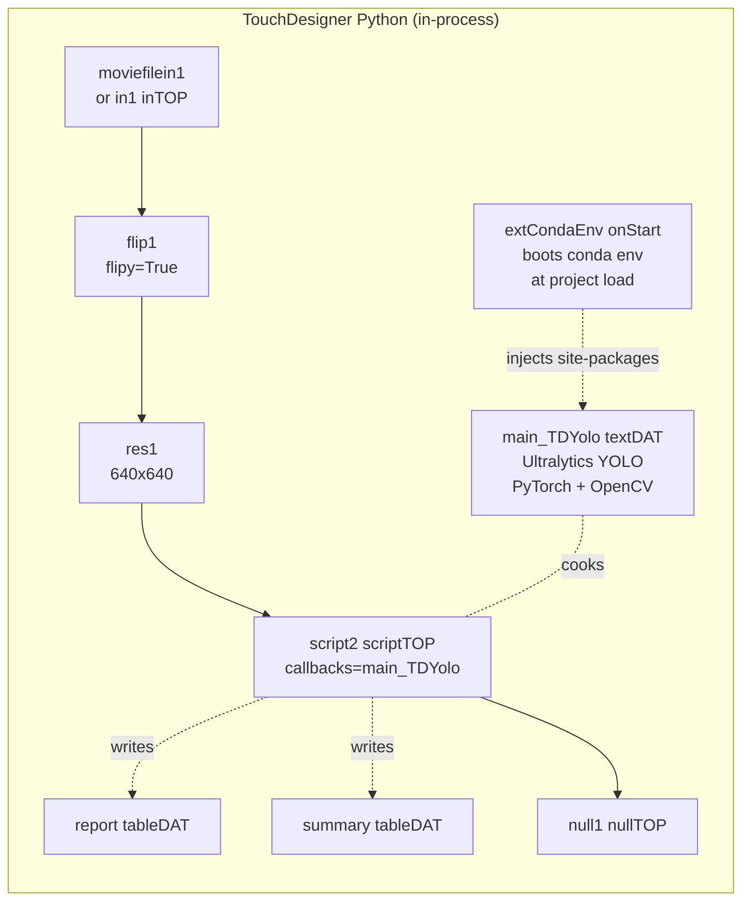
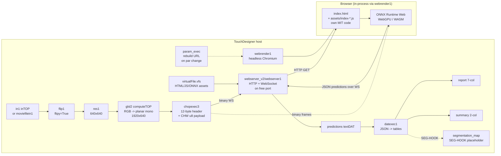
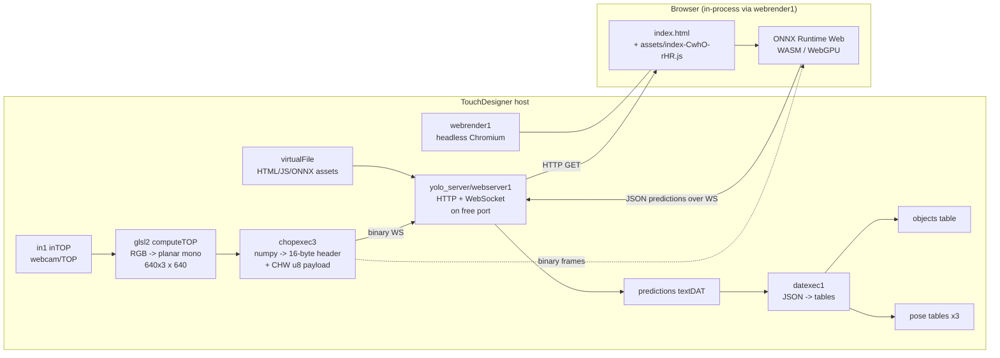

# TDYolo vs TDYolo_v2 vs Yolo Container — Comparison

> Side-by-side analysis of the YOLO subsystems related to `TDYolo.toe`. This
> is a *synthesis* document. For full architectural detail see:
>
> - **`ARCHITECTURE-TDYolo.md`** — the user-built in-process Python pipeline at
>   `/project1/TDYolo`. The original v1.
> - **`ARCHITECTURE-TDYolo_v2.md`** — the user-built drop-in browser-based ONNX
>   pipeline at `/project1/TDYolo_v2`. **Recommended for new projects** — no
>   conda env required, MIT licensed.
> - **`ARCHITECTURE-yolo.md`** — the third-party AGPL browser-based ONNX
>   bridge at `/project1/yolo`. The architectural inspiration for v2.

---

## 1. TL;DR

You have **three YOLO subsystems** related to this project, built by different
people for different goals:

- **`TDYolo` baseCOMP** is hand-built. It runs Ultralytics YOLO directly inside
  TouchDesigner's Python interpreter via a `scriptTOP`, talking to PyTorch.
  Detections are written into two table DATs (`report`, `summary`) and the
  drawn-on video comes back as a TOP. Lightweight, hackable, depends on a
  conda environment. **The legacy v1.**

- **`TDYolo_v2` baseCOMP** is the **drop-in successor**. Same `report` /
  `summary` schema as v1 (so existing downstream wiring keeps working), but
  inference now runs in a headless browser via ONNX Runtime Web — **no conda
  env required on the user's machine**. MIT licensed, written from scratch
  with the third-party `yolo` container as architectural inspiration only
  (no source copied).

- **`yolo` containerCOMP** is the [`yolo-touchdesigner`](https://github.com/torinmb/yolo-touchdesigner)
  component by Torin Blankensmith. It runs YOLO in a **web browser** via ONNX
  Runtime Web, served from a TouchDesigner-hosted HTTP/WebSocket server on a
  free local port. TD pushes frames in as binary WebSocket; predictions come
  back as JSON. Self-contained 1.1 GB .tox with every ONNX model embedded;
  no Python deps needed. **AGPL-3.0+ — copyleft applies to modifications.**

| Question | TDYolo (v1) | TDYolo_v2 | Yolo container |
| --- | --- | --- | --- |
| **Where does YOLO actually run?** | TD Python (PyTorch) | Headless Chromium (ONNX RT Web) | Headless Chromium (ONNX RT Web) |
| **Weights file format?** | `.pt` | `.onnx` | `.onnx` |
| **Conda/PyTorch on user's machine?** | yes | **no** | no |
| **Pose / OBB / segmentation?** | detection only | detection only (segmentation hooks ready for v2.1) | detection + pose + OBB + segmentation + DETR |
| **License?** | your own code | **MIT** | AGPL-3.0+ |
| **First call when in doubt?** | Need to hack the Python inference loop | **Default for new TDYolo work — drop-in, MIT, no install** | Need pose / OBB / many model variants out of the box |

---

## 2. Identity & License

| | **TDYolo (v1)** | **TDYolo_v2** | **Yolo container** |
| --- | --- | --- | --- |
| Path in `TDYolo.toe` | `/project1/TDYolo` (baseCOMP) | `/project1/TDYolo_v2` (baseCOMP) | `/project1/yolo` (containerCOMP) |
| Origin | Hand-built by `patrickhartono` | Hand-built by `patrickhartono`; architectural pattern inspired by `torinmb/yolo-touchdesigner` (no source copied) | `torinmb` / Blankensmithing LLC |
| Upstream repo | None — code lives in `python-script/main-TDYolo.py` next to the .toe | None — code lives in `tdyolo-web/` next to the .toe | https://github.com/torinmb/yolo-touchdesigner |
| Version tag | v2.0.0 (per `README.md`, "GPU Acceleration Release") | `0.1.0` (per `About` custom param) | `0.1.0` (per `About` custom param) |
| License | None imposed — author's choice | **MIT** (see `tdyolo-web/LICENSE`) | **AGPL-3.0+** (network-use copyleft) |
| Distribution | Source files on disk + `.toe` | `tdyolo-web/` source + embedded VFS bundle inside the baseCOMP + `.toe` | Single `yolo_1_0.tox` (1.1 GB binary) |
| External dependencies | Python conda env with `ultralytics`, `torch`, `opencv-python`, `numpy` | None — entire JS + ONNX bundle lives in VFS | None — entire JS + ONNX bundle lives in VFS |

### Licensing nuance

The Yolo container's **AGPL-3.0+** has a "network use" clause (§13): if you
*modify* the bundled JS or webserver code and let someone else interact with
it over a network (which is what running a webserverDAT does), you must offer
the modified source. In practice this matters for installation/venue use
where the .tox is exposed to other machines. For a single-host artist
workflow it's effectively MIT-equivalent.

TDYolo has no inherited license — the code is yours.

**TDYolo_v2** is explicitly **MIT-licensed** (see `tdyolo-w eb/LICENSE`). The
JS app does *not* import or copy any source from `yolo-touchdesigner`; only
the architectural pattern (browser-hosted ONNX inference, frames over
WebSocket) is shared, and that pattern itself is not copyrightable. This was
a deliberate choice so the component is safe to share with students and
re-distribute as open source.

---

## 3. Architecture diagrams side-by-side

### 3.1 TDYolo: in-process Python



Single TD process; everything runs in the same memory space.

### 3.2 TDYolo_v2: in-bundle browser bridge



Same browser-bridge pattern as the yolo container, but:

- Detection only (segmentation hooks ready for v2.1).
- 12-byte binary header (vs the container's 16-byte).
- Output schema preserves v1's `report` / `summary` shape exactly.
- MIT-licensed from-scratch JS.

### 3.3 Yolo container: browser bridge



Two processes; data crosses an HTTP/WebSocket boundary on every frame.

**Fundamental difference**: where the YOLO weights run. Everything else
(input pipeline, table writers, custom params) is structurally similar but
implemented differently for the runtime each chose.

---

## 4. Inference engine & pipeline

| | **TDYolo (v1)** | **TDYolo_v2** | **Yolo container** |
| --- | --- | --- | --- |
| Inference engine | `ultralytics.YOLO()` (PyTorch) | `onnxruntime-web` (WebGPU / WASM) | `onnxruntime-web` (WebGPU / WASM) |
| Weights format | `.pt` (PyTorch state_dict) | `.onnx` (ONNX export) | `.onnx` (ONNX export) |
| Where weights live | `yolo11n.pt` on disk next to .toe | `yolo11n.onnx` embedded in baseCOMP VFS (~10 MB) | All `yolo11*.onnx` variants embedded in container VFS (~1.1 GB) |
| Input format to model | NumPy uint8 BGR `(640, 640, 3)`, in-process | float32 CHW `(1, 3, 640, 640)` planar, over binary WS | float32 CHW `(1, 3, 640, 640)` planar, over binary WS |
| Pre-processing | `cv2.cvtColor(RGBA→BGR)`; in-script | own GLSL compute shader (single pass) → 12-byte header binary WS | torinmb's GLSL packer → 16-byte header binary WS |
| Post-processing | Ultralytics handles NMS internally | JS `decodeYOLO()` + `nmsPerClass()` per-class, written from scratch | `yolo-decoder.onnx` (1.9 KB ONNX NMS) on GPU when available, else JS NMS |
| Dynamic image size | Yes — 416 / 640 / 832 based on prior detections | No — fixed 640 × 640 | No — fixed 640 × 640 |
| Half precision | Yes on MPS (`half=True`) | No (fp32 inputs) | No (fp32 inputs) |
| `torch.compile` | Yes, `mode='max-autotune'` | N/A | N/A |

---

## 5. Feature matrix

| Feature | **TDYolo (v1)** | **TDYolo_v2** | **Yolo container** |
| --- | --- | --- | --- |
| Object detection | ✅ | ✅ | ✅ |
| Pose / skeleton (17 keypoints) | ❌ | ❌ (not planned) | ✅ |
| OBB | ❌ | ❌ | ✅ |
| Segmentation (instance masks) | ❌ | 🔜 SEG-HOOK stubs ready for v2.1 | ✅ (latent in source) |
| DETR / v26 models | ❌ | ❌ | ✅ auto-detected |
| Multi-frame tracking | ❌ per-class counter | ❌ per-class counter | ✅ IoU greedy tracker |
| Tracker ID persistence | Per-frame only | Per-frame only | Monotonic page-life IDs |
| Dynamic class filter | ✅ `parameter1[1,1]` | ✅ `Detectionlables` URL param | ❌ |
| Confidence threshold | ✅ `Confidence` | ✅ `Confidence` | ✅ `Detscoret` / `Posescoret` |
| NMS IoU | inside Ultralytics defaults | fixed `0.45` in `onnx.js` (not user-tunable) | ✅ `Detiout` / `Poseiout` |
| Top-K detection limit | ✅ keeps top N | ✅ `Detectionlimit` URL param | ✅ `Dettopk` / `Posetopk` |
| Frame skipping | ✅ `Frameskip` | ✅ `Frameskip` URL param | ❌ |
| Drawing on-image | ✅ `cv2.rectangle` | ❌ inside TD (drawing happens in browser canvas) | ❌ inside TD |
| Aspect-ratio correction | ❌ | ❌ (640×640 input, square assumption) | ✅ `Aspectcorrection*` params |
| Multi-camera input | ❌ | ❌ (one input slot) | ❌ (one `in1` + Webcam menu) |
| Model menu in UI | ❌ | ✅ `Model` menu (only `yolo11n` bundled in MVP) | ✅ 11 det + 5 pose models |
| Output formats | `report` + `summary` tableDATs, annotated TOP | `report` (7) + `summary` (2) + `synched_frame` TOP + `segmentation_map` (SEG-HOOK) | `objects`, `pose_objects`, `pose`, `joints`, `players` (5 tables) |

---

## 6. Output schema differences

This is the **biggest gotcha** if you ever want to migrate code between v1/v2
and the container.

> **TDYolo_v2 preserves v1's schema exactly** (7-col `report`, 2-col
> `summary`, same column names, same coordinate convention). Migrating from
> v1 → v2 is just re-pointing existing `dattochop` / `mergeDAT` nodes; no
> schema changes needed. The mismatch is purely between either of
> (`TDYolo` / `TDYolo_v2`) and the third-party `yolo` container.

### 6.1 TDYolo `report` table (same shape in v1 and v2)

```
Object_Type | Confidence | X_Center | Y_Center | Width | Height | ID
car         | 0.894      | 38.3     | 423.0    | 76.6  | 132.0  | 1
person      | 0.513      | 371.0    | 404.0    | 37.5  | 177.0  | 1
person      | 0.374      | 374.0    | 373.8    | 44.5  | 237.5  | 2
```

- 7 columns.
- **Coordinates in pixels** (640-space, since that's what `res1` produces).
- `ID` is a **per-class running counter** reset each frame.
- `Object_Type` is the resolved class name string.
- Values stored as formatted strings (`.3f` for confidence, `.1f` for coords).

### 6.2 Yolo container `objects` (and `pose_objects`) table

```
id  | object | object_id | x      | y      | width  | height | score
318 | person | 0         | 0.290  | 0.005  | 0.615  | 0.327  | 0.502
```

- 8 columns.
- **Coordinates normalised** to [0, 1] in TD's flipped frame (bottom-left
  origin, Y-up via `mapBoxYFlipNorm`).
- `id` is a **monotonic tracker ID** that persists across frames as long as
  the IoU tracker keeps matching.
- `object` is the resolved class name, `object_id` is the numeric class index.
- Detection rows use **center** `(x, y)`; pose rows use **top-left**
  `(x, y)`. (See `ARCHITECTURE-yolo.md` §12.1 / §B.10 for the verified
  asymmetry.)

### 6.3 Migration guide

**TDYolo (v1) ↔ TDYolo_v2**: schemas are **identical**. No work required.
Re-point your existing `dattochop` / `mergeDAT` / `XY_from_Row*` operators
from `TDYolo/report` to `TDYolo_v2/report` (or use the top-level alias DAT
if you have one).

**TDYolo (v1 or v2) → Yolo container**: you need to:

1. Rename columns: `Object_Type → object`, `Confidence → score`,
   `X_Center → x` (and remember it's now center), `Y_Center → y`, etc.
2. Rescale coordinates from pixels → normalised: divide by 640.
3. Flip Y: `y_new = 1 - y_old`.
4. Reinterpret `ID`: track IDs are no longer per-class running counters,
   they're monotonic and class-agnostic.
5. Adjust aspect-correction expectations: TDYolo doesn't do any, the
   container does.

Going the other direction (container → TDYolo) is symmetric.

---

## 7. Performance characteristics

| | **TDYolo** | **Yolo container** |
| --- | --- | --- |
| End-to-end latency contributors | Ultralytics inference + OpenCV conversions + table writes. One process, no IPC overhead. | TD GLSL pack + `chopexec3.numpyArray(delayed=True)` + binary WS send + browser ONNX + JS NMS + WS JSON receive + `datexec1` parse. Multiple async boundaries. |
| GPU paths | **MPS** (Apple Silicon, default), **CUDA**, CPU fallback. PyTorch handles dispatch. | **WebGPU** (default), **WASM** fallback. NMS pre-bound to GPU buffers when WebGPU available. |
| Half precision | ✅ on MPS (`half=True`) | ❌ |
| Frame drop policy | None — every cook calls inference (subject to `Frameskip`) | Latest-job-wins queue in `pumpBinary()` — old frames dropped under load |
| Memory cleanup | Manual `torch.mps.empty_cache()` every 30 frames | Pre-allocated tensors reused across frames; no explicit cache mgmt needed |
| Online perf monitoring | ✅ logs avg FPS every 100 frames to textport | Browser-side keepalive + TD-side `frame_drops` constant CHOPs |
| Throughput expectation* | NVIDIA: 30-60 FPS, M-series Mac: 20-40 FPS, CPU: 3-15 FPS (per README) | Depends on browser+GPU; no published numbers in the .tox docs |

*Numbers from `README.md` and the component README's own performance section.
These are author-reported, not independently benchmarked here.

---

## 8. Operational tradeoffs

### 8.1 Install footprint

| | **TDYolo** | **Yolo container** |
| --- | --- | --- |
| `.tox`/`.toe` size | small `.toe` + 5.4 MB `yolo11n.pt` | **1.1 GB** `yolo_1_0.tox` (every ONNX model embedded) |
| Third-party deps | Conda env with PyTorch + Ultralytics + OpenCV (~3 GB on disk) | **None** — entire stack lives in VFS |
| First-run setup | `conda env create -f environment-mac.yml` (or windows variant), then load `.toe` | Just load `.toe` |
| Cross-platform | macOS + Windows, depends on conda + GPU drivers | macOS + Windows, depends only on TouchDesigner's bundled Chromium |

### 8.2 `.toe` save time

- The container's 1.1 GB VFS payload is the reason `external_tox_check` nags
  you to externalise `yolo.tox` — saving the parent `.toe` with the .tox
  inlined takes many seconds. Externalised, save is normal.
- TDYolo has no such issue: scripts and tableDATs are tiny.

### 8.3 Development workflow

| | **TDYolo** | **Yolo container** |
| --- | --- | --- |
| Edit inference logic | Edit `main-TDYolo.py` (or the `main_TDYolo` textDAT). Hot-reload via Save in TD. | Edit JS in the upstream repo, `npm run build`, then re-embed `dist/` into VFS via `VirtualFileExt.AddFromTable`. |
| Debug runtime errors | TD textport (Python tracebacks visible inline) | Chromium DevTools on `http://localhost:9222` (port hard-coded in `webrender1.par.options`) |
| Custom param changes | Re-pulse the scriptTOP, `onSetupParameters` runs again | Edit URL builder in `webrender1.par.url` + reload via `Reset` pulse |
| Add a new feature | Pure Python edit | TypeScript/JS edit + Vite build + VFS re-embed |

TDYolo wins on hackability; the container wins on plug-and-play.

---

## 9. Licensing implications

### 9.1 TDYolo

No license imposed by upstream — the inference code is yours. You can:

- Ship in commercial installations without restrictions.
- Modify, fork, or rewrite at will.
- Bundle into proprietary products.

(The `ultralytics` Python package itself is **AGPL-3.0**, but that license
governs how *you* distribute Ultralytics, not how a user network you write
that imports it does. If you redistribute `ultralytics` together with your
TDYolo, the AGPL terms apply to that redistribution — but the boundary is
clear: TD users install ultralytics from conda, you don't ship it.)

### 9.2 Yolo container

**AGPL-3.0+** — strict copyleft with network-use clause:

- If you **don't modify** the bundled JS / Python source inside the .tox,
  you can use it in any project (commercial included).
- If you **modify** the AGPL-licensed parts and let someone *interact with
  the modified version over a network* (which happens any time TouchDesigner
  serves the bundle from `webserver1` to a browser — even just your own
  loopback browser counts if you're sharing the modified .tox), you must
  publish the modified source under AGPL-3.0+.
- The WebSocket boundary is the GPL's "module boundary" — your TD network
  that *consumes* the JSON predictions stays your own; the JS that *produces*
  them is AGPL.

The upstream `README.md` says the same thing in plainer language: "as long
as you don't modify the plugin's source, you're free to use it in commercial
projects without open-sourcing your codebase."

---

## 10. Decision flowchart: which to choose

```mermaid
flowchart TD
    START([Need YOLO in TouchDesigner])
    POSE{Pose / OBB / DETR<br/>needed?}
    SHARE{Sharing the project<br/>with non-technical users<br/>(students, audience)?}
    PYTHON{Need to deeply hack<br/>the Python inference loop?}
    LICENSE{Worried about<br/>AGPL-3.0 obligations?}
    GPU{No GPU at all?}

    YOLOCONT[Use Yolo container<br/>see ARCHITECTURE-yolo.md]
    TDYOLOv1[Use TDYolo v1<br/>see ARCHITECTURE-TDYolo.md]
    TDYOLOv2[Use TDYolo_v2<br/>see ARCHITECTURE-TDYolo_v2.md]

    START --> POSE
    POSE -- yes --> YOLOCONT
    POSE -- no --> SHARE
    SHARE -- yes --> TDYOLOv2
    SHARE -- no --> PYTHON
    PYTHON -- yes --> TDYOLOv1
    PYTHON -- no --> LICENSE
    LICENSE -- yes --> TDYOLOv2
    LICENSE -- no --> GPU
    GPU -- yes --> TDYOLOv1
    GPU -- no --> TDYOLOv2
```

Plain-English decision rules (in order of decisiveness):

1. **Need pose / OBB / DETR?** → **Yolo container**. TDYolo (both versions)
   are detection-only.
2. **Sharing with students / audience / open source?** → **TDYolo_v2**.
   No conda env to install, drop-in, MIT-licensed.
3. **Need to deeply hack the Python inference loop?** → **TDYolo v1**.
   Pure Python beats minified JS for in-place edits.
4. **Worried about AGPL obligations?** → **TDYolo_v2** (MIT) or **TDYolo v1**
   (your own code). Avoid the container if you'll modify its source.
5. **No GPU at all on the target machine?** → **TDYolo v1** (CPU PyTorch
   works, just slow). TDYolo_v2 / container both depend on webrenderTOP +
   ONNX RT Web running acceptably on CPU, which is workable but slower than
   v1's CPU path.

**Default for new work in this repo: TDYolo_v2.** It has the same schema as
v1 (so old wiring still works) but doesn't require users to install conda.

---

## 11. Interoperation

### 11.1 Can they run at the same time?

**Yes** — they're entirely independent. No shared state, no shared
operators. The Yolo container uses its own webserverDAT on a dynamically
chosen port; TDYolo just calls Python inside a scriptTOP. No conflicts.

### 11.2 Can they share data?

Not designed to, but possible via standard TD plumbing:

- Both write to **tableDATs**. You can `mergeDAT` their outputs (after
  schema reconciliation per §6.3) for a combined detection feed.
- Coordinates need rescaling (pixels ↔ normalised) and Y-flip if you mix
  them.
- IDs are not compatible — one is per-class running, the other is monotonic
  tracker. Treat them as separate ID spaces.

### 11.3 A/B testing pattern

A reasonable use of having both:

- **TDYolo** on your primary high-frame-rate camera (low overhead, full
  control over what you log).
- **Yolo container** on a secondary feed for pose tracking that TDYolo
  can't do.

The container's `Generateposetrackingui` pulse copies an external visualiser
out of the .tox so you can wire skeleton output into your own scene
independently of where the detection-only TDYolo lives.

### 11.4 Don't try to share inference

Despite both running "YOLO", they use:

- Different weights formats (`.pt` vs `.onnx`).
- Different normalisation conventions.
- Different post-processing assumptions.

You can't take a frame TDYolo just processed and feed it into the container's
JS pipeline (or vice versa) without going through the model again.

---

## 12. At-a-glance cheat sheet

| Question | **TDYolo (v1)** | **TDYolo_v2** | **Yolo container** |
| --- | --- | --- | --- |
| Inference runs in… | TD Python (`scriptTOP`) | Browser (Chromium / ONNX RT Web) | Browser (Chromium / ONNX RT Web) |
| Model file | `yolo11n.pt` on disk | `yolo11n.onnx` in VFS | `.onnx` (11+ variants) in VFS |
| TD-side hot path | `main_TDYolo.onCook` | `chopexec3` (12-byte header) | `chopexec3` (16-byte header) |
| What enters inference | uint8 BGR 640×640 | float32 CHW 1×3×640×640 | float32 CHW 1×3×640×640 |
| Tracking algorithm | None (per-frame per-class counter) | None (per-frame per-class counter) | IoU greedy matcher |
| Pose / skeleton | ❌ | ❌ | ✅ 17 keypoints |
| Segmentation | ❌ | 🔜 SEG-HOOK ready for v2.1 | ✅ in source |
| Output style | 2 tables + annotated TOP | 2 tables + synched TOP + seg placeholder | 5 tables |
| Coords in tables | Pixels (640-space) | Pixels (640-space) | Normalised [0,1], Y-flipped |
| Tracker IDs | Per-class, per-frame | Per-class, per-frame | Monotonic across page life |
| GPU acceleration | PyTorch: CUDA / MPS / CPU | ONNX RT Web: WebGPU / WASM | ONNX RT Web: WebGPU / WASM |
| Custom params | Yolo + Conda pages | Detection + Segmentation (placeholder) + Server + About | Settings + Object Tracking + Pose Tracking + About |
| Install effort | conda env + PyTorch + Ultralytics | **None — drop-in** | None — drop-in |
| Size on disk | < 1 MB + 5.4 MB `yolo11n.pt` | ~10 MB model + ~131 MB JS/WASM bundle | 1.1 GB |
| License | Your call | **MIT** | AGPL-3.0+ |
| Debug surface | TD textport | TD textport + open `http://localhost:<port>` in real Chrome | Chromium DevTools `localhost:9222` |
| Hackability | High (pure Python) | Medium (own JS bundle, Vite build) | Low (minified JS bundle) |
| Plug-and-play factor | Low | **High** | High |
| Documentation | `ARCHITECTURE-TDYolo.md` | `ARCHITECTURE-TDYolo_v2.md` | `ARCHITECTURE-yolo.md` |

---

## Cross-references

- Full architecture details for the legacy v1 (in-process Python):
  [`ARCHITECTURE-TDYolo.md`](ARCHITECTURE-TDYolo.md) — Identity, custom
  parameters, full `main_TDYolo` source dump with annotation, top-level
  extraction pipeline, lifecycle, glossary.
- Full architecture details for the drop-in v2 (browser-based ONNX, MIT):
  [`ARCHITECTURE-TDYolo_v2.md`](ARCHITECTURE-TDYolo_v2.md) — node-by-node
  reference, custom parameters, frame transmitter (12-byte header), browser
  app structure, SEG-HOOK index for v2.1 work, observed pitfalls.
- User-facing quickstart for v2: [`README-TDYolo_v2.md`](README-TDYolo_v2.md).
- Full architecture details for the third-party browser bridge:
  [`ARCHITECTURE-yolo.md`](ARCHITECTURE-yolo.md) — `yolo_server` WebSocket
  bridge, virtualFile VFS, `parexec1` / `datexec1` / `chopexec3` annotated
  source, `pose_lines0` skeleton partition, browser-app internals
  (Appendix B), verified corrections (Appendix C).
- Upstream repo for the container code (clone for hackability):
  https://github.com/torinmb/yolo-touchdesigner
- Ultralytics homepage (the model + `YOLO()` Python class used by TDYolo):
  https://github.com/ultralytics/ultralytics

---

*This document is a synthesis across the two architecture references; every
factual claim above is independently verified in one of those documents. No
new MCP queries or source reads were required to produce it.*
